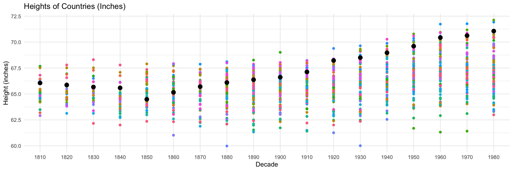

## Libraries and Files


::: {.cell}

```{.r .cell-code}
library(tidyverse)
library(ggplot2)
library(dplyr)
library(readxl)
library(tidyr)
library(downloader)
library(pander)

mean_heights <- read_excel("week_04/Height.xlsx", skip = 2)
```
:::


# Task: Country Heights


::: {.cell}

```{.r .cell-code}
row_height <- mean_heights[, colSums(is.na(mean_heights)) < nrow(mean_heights)]
col_height <- mean_heights[rowSums(is.na(mean_heights)) != ncol(mean_heights),]
mean_heights <- mean_heights |>
    pivot_longer(c("1810","1820","1830","1840","1850","1860","1870","1880","1890","1900","1910","1920","1930","1940","1950","1960","1970","1980"),
                 values_to = "height.cm", 
                 names_to = "year_decade")  
mean_heights <- mean_heights |> filter(!is.na(height.cm) & !is.na(Code))
mean_heights <- mean_heights |>
    rename_at(2, ~"country") |>
    select("Code", "country", "height.cm", "year_decade")
mean_heights$height_in <- mean_heights$height.cm / 2.54
mean_heights_cleaned <- mean_heights |> 
  rename(country = 2) |> 
  select(Code, country, height.cm, year_decade)
pander(mean_heights_cleaned,
       col.names = c("Code", "country", "height_cm", "year_decade"))
```

::: {.cell-output-display}

-----------------------------------------------------------------
 Code              country               height_cm   year_decade 
------ -------------------------------- ----------- -------------
  40               Austria                 163.7        1820     

  40               Austria                 163.4        1830     

  40               Austria                 164.8        1840     

  40               Austria                 165.8        1850     

  40               Austria                 166.4        1860     

  40               Austria                 167.2        1870     

  40               Austria                 167.7        1880     

  40               Austria                 168.4        1890     

  40               Austria                 168.9        1900     

  40               Austria                 168.9        1910     

  40               Austria                 170.4        1920     

  40               Austria                  177         1960     

  40               Austria                 177.5        1970     

  40               Austria                 178.8        1980     

  56               Belgium                 163.1        1810     

  56               Belgium                 163.7        1820     

  56               Belgium                  164         1830     

  56               Belgium                 165.1        1840     

  56               Belgium                 166.1        1850     

  56               Belgium                 166.6        1860     

  56               Belgium                 166.6        1870     

  56               Belgium                 167.8        1900     

  56               Belgium                 174.5        1940     

  56               Belgium                 176.8        1960     

 280     Federal Republic of Germany       167.8        1810     
                 (until 1990)                                    

 280     Federal Republic of Germany       167.3        1820     
                 (until 1990)                                    

 280     Federal Republic of Germany       166.8        1830     
                 (until 1990)                                    

 280     Federal Republic of Germany       166.6        1840     
                 (until 1990)                                    

 280     Federal Republic of Germany       163.8        1850     
                 (until 1990)                                    

 280     Federal Republic of Germany       165.5        1860     
                 (until 1990)                                    

 280     Federal Republic of Germany       166.9        1870     
                 (until 1990)                                    

 280     Federal Republic of Germany       167.9        1880     
                 (until 1990)                                    

 280     Federal Republic of Germany       168.6        1890     
                 (until 1990)                                    

 280     Federal Republic of Germany       169.2        1900     
                 (until 1990)                                    

 280     Federal Republic of Germany       170.5        1910     
                 (until 1990)                                    

 280     Federal Republic of Germany       173.3        1920     
                 (until 1990)                                    

 280     Federal Republic of Germany        174         1930     
                 (until 1990)                                    

 280     Federal Republic of Germany       175.2        1940     
                 (until 1990)                                    

 280     Federal Republic of Germany       176.8        1950     
                 (until 1990)                                    

 280     Federal Republic of Germany       178.9        1960     
                 (until 1990)                                    

 280     Federal Republic of Germany       179.4        1970     
                 (until 1990)                                    

 280     Federal Republic of Germany       180.5        1980     
                 (until 1990)                                    

 250                France                 163.9        1810     

 250                France                 163.9        1820     

 250                France                  164         1830     

 250                France                 164.3        1840     

 250                France                 165.2        1850     

 250                France                 165.4        1860     

 250                France                 165.5        1870     

 250                France                 165.9        1880     

 250                France                 166.1        1890     

 250                France                 166.8        1900     

 250                France                 167.8        1910     

 250                France                 168.5        1920     

 250                France                 169.9        1930     

 250                France                 171.7        1940     

 250                France                 173.2        1950     

 250                France                 174.9        1960     

 250                France                 175.1        1970     

 250                France                 176.5        1980     

 276               Germany                 167.8        1810     

 276               Germany                 167.3        1820     

 276               Germany                 166.8        1830     

 276               Germany                 166.6        1840     

 276               Germany                 163.8        1850     

 276               Germany                 165.5        1860     

 276               Germany                 166.9        1870     

 276               Germany                 167.9        1880     

 276               Germany                 168.6        1890     

 276               Germany                 169.2        1900     

 276               Germany                 170.5        1910     

 276               Germany                 173.3        1920     

 276               Germany                  174         1930     

 276               Germany                 175.2        1940     

 276               Germany                 176.8        1950     

 276               Germany                 178.9        1960     

 276               Germany                 179.4        1970     

 276               Germany                 180.5        1980     

 528             Netherlands                166         1810     

 528             Netherlands               165.1        1820     

 528             Netherlands               164.2        1830     

 528             Netherlands               164.5        1840     

 528             Netherlands               165.3        1850     

 528             Netherlands               166.5        1860     

 528             Netherlands               167.1        1870     

 528             Netherlands               168.5        1880     

 528             Netherlands               169.4        1890     

 528             Netherlands               170.9        1900     

 528             Netherlands               172.6        1910     

 528             Netherlands               173.5        1920     

 528             Netherlands               174.1        1930     

 528             Netherlands               177.5        1940     

 528             Netherlands               178.7        1950     

 528             Netherlands               182.2        1960     

 528             Netherlands               182.3        1970     

 528             Netherlands               182.7        1980     

 756             Switzerland               167.6        1820     

 756             Switzerland               166.3        1830     

 756             Switzerland               164.7        1870     

 756             Switzerland               166.8        1880     

 756             Switzerland               170.5        1890     

 756             Switzerland               170.5        1900     

 756             Switzerland               171.5        1910     

 756             Switzerland               170.9        1920     

 756             Switzerland               171.3        1930     

 208               Denmark                  167         1820     

 208               Denmark                 165.4        1830     

 208               Denmark                 167.4        1850     

 208               Denmark                 168.1        1860     

 208               Denmark                 168.1        1870     

 208               Denmark                 169.5        1880     

 208               Denmark                 169.2        1890     

 208               Denmark                 170.5        1900     

 208               Denmark                  170         1910     

 208               Denmark                 173.5        1920     

 208               Denmark                 173.9        1930     

 208               Denmark                 175.9        1940     

 208               Denmark                 179.8        1950     

 208               Denmark                 180.2        1960     

 208               Denmark                 180.8        1970     

 208               Denmark                 183.2        1980     

 233               Estonia                 166.7        1840     

 233               Estonia                 167.6        1870     

 233               Estonia                 173.4        1890     

 233               Estonia                 175.3        1900     

 233               Estonia                  172         1910     

 233               Estonia                 174.1        1960     

 233               Estonia                 179.6        1970     

 233               Estonia                 179.1        1980     

 246               Finland                 171.9        1810     

 246               Finland                  170         1820     

 246               Finland                 169.5        1830     

 246               Finland                 167.3        1860     

 246               Finland                 167.3        1900     

 246               Finland                 170.5        1910     

 246               Finland                 172.3        1920     

 246               Finland                 172.5        1930     

 246               Finland                 174.8        1940     

 246               Finland                  178         1950     

 246               Finland                 179.3        1960     

 246               Finland                 177.5        1970     

 246               Finland                 178.2        1980     

 372               Ireland                  168         1810     

 372               Ireland                 165.4        1820     

 372               Ireland                 168.1        1830     

 372               Ireland                 160.9        1840     

 372               Ireland                 168.4        1870     

 372               Ireland                 168.7        1880     

 372               Ireland                 169.1        1890     

 372               Ireland                  170         1900     

 372               Ireland                 171.9        1920     

 372               Ireland                 173.3        1930     

 372               Ireland                 174.9        1950     

 372               Ireland                 175.8        1960     

 372               Ireland                 176.4        1970     

 372               Ireland                 176.6        1980     

 428                Latvia                 166.5        1840     

 428                Latvia                 170.6        1880     

 428                Latvia                 171.7        1890     

 428                Latvia                 171.4        1900     

 428                Latvia                 174.2        1940     

 440              Lithuania                165.3        1840     

 440              Lithuania                173.7        1940     

 578                Norway                 168.6        1810     

 578                Norway                 167.5        1820     

 578                Norway                 168.9        1830     

 578                Norway                  168         1840     

 578                Norway                 169.1        1850     

 578                Norway                 169.7        1860     

 578                Norway                 170.4        1870     

 578                Norway                 171.1        1880     

 578                Norway                 171.1        1890     

 578                Norway                  172         1900     

 578                Norway                 173.3        1910     

 578                Norway                 176.2        1920     

 578                Norway                 176.9        1930     

 578                Norway                 177.5        1940     

 578                Norway                 178.1        1950     

 578                Norway                 179.3        1960     

 578                Norway                 179.5        1970     

 578                Norway                 179.7        1980     

 752                Sweden                 168.1        1830     

 752                Sweden                 167.9        1840     

 752                Sweden                 168.4        1850     

 752                Sweden                 169.3        1860     

 752                Sweden                 170.3        1870     

 752                Sweden                 171.2        1880     

 752                Sweden                 172.4        1890     

 752                Sweden                 172.8        1900     

 752                Sweden                 173.2        1910     

 752                Sweden                 168.3        1920     

 752                Sweden                 175.5        1930     

 752                Sweden                 178.5        1940     

 752                Sweden                 179.3        1950     

 752                Sweden                 180.1        1960     

 752                Sweden                  180         1970     

 752                Sweden                 180.4        1980     

 826       United Kingdom of Great         169.7        1810     
         Britain and Northern Ireland                            

 826       United Kingdom of Great         169.1        1820     
         Britain and Northern Ireland                            

 826       United Kingdom of Great         166.7        1830     
         Britain and Northern Ireland                            

 826       United Kingdom of Great         166.5        1840     
         Britain and Northern Ireland                            

 826       United Kingdom of Great         165.6        1850     
         Britain and Northern Ireland                            

 826       United Kingdom of Great         166.6        1860     
         Britain and Northern Ireland                            

 826       United Kingdom of Great         167.2        1870     
         Britain and Northern Ireland                            

 826       United Kingdom of Great          168         1880     
         Britain and Northern Ireland                            

 826       United Kingdom of Great         167.4        1890     
         Britain and Northern Ireland                            

 826       United Kingdom of Great         169.4        1900     
         Britain and Northern Ireland                            

 826       United Kingdom of Great         170.9        1910     
         Britain and Northern Ireland                            

 826       United Kingdom of Great          171         1920     
         Britain and Northern Ireland                            

 826       United Kingdom of Great         173.9        1930     
         Britain and Northern Ireland                            

 826       United Kingdom of Great         174.9        1940     
         Britain and Northern Ireland                            

 826       United Kingdom of Great          176         1950     
         Britain and Northern Ireland                            

 826       United Kingdom of Great         176.9        1960     
         Britain and Northern Ireland                            

 826       United Kingdom of Great         177.1        1970     
         Britain and Northern Ireland                            

 826       United Kingdom of Great         176.8        1980     
         Britain and Northern Ireland                            

  8                Albania                 170.1        1880     

  8                Albania                 169.8        1890     

  8                Albania                 169.2        1900     

 191               Croatia                 163.2        1810     

 191               Croatia                 163.6        1820     

 191               Croatia                 163.5        1830     

 191               Croatia                 161.2        1840     

 191               Croatia                 168.1        1850     

 191               Croatia                 165.9        1860     

 191               Croatia                 166.8        1870     

 191               Croatia                 168.9        1880     

 191               Croatia                 171.5        1900     

 191               Croatia                 176.1        1930     

 191               Croatia                 175.1        1950     

 191               Croatia                 178.2        1960     

 300                Greece                 168.5        1870     

 300                Greece                 167.3        1880     

 300                Greece                 169.6        1900     

 300                Greece                 168.1        1910     

 300                Greece                 168.4        1920     

 300                Greece                 167.5        1930     

 300                Greece                 169.2        1940     

 300                Greece                 173.7        1950     

 300                Greece                 177.6        1960     

 300                Greece                 177.3        1980     

 380                Italy                  164.1        1810     

 380                Italy                  165.8        1820     

 380                Italy                  164.1        1830     

 380                Italy                   162         1840     

 380                Italy                  162.9        1850     

 380                Italy                  163.1        1860     

 380                Italy                  163.5        1870     

 380                Italy                  163.9        1880     

 380                Italy                  164.7        1890     

 380                Italy                  165.6        1900     

 380                Italy                  166.3        1910     

 380                Italy                  167.3        1920     

 380                Italy                  168.1        1930     

 380                Italy                  169.3        1940     

 380                Italy                  171.3        1950     

 380                Italy                   173         1960     

 380                Italy                  174.1        1970     

 380                Italy                  174.5        1980     

 620               Portugal                165.5        1810     

 620               Portugal                166.3        1820     

 620               Portugal                165.3        1830     

 620               Portugal                163.5        1840     

 620               Portugal                164.2        1850     

 620               Portugal                164.1        1860     

 620               Portugal                164.7        1870     

 620               Portugal                164.2        1880     

 620               Portugal                164.2        1890     

 620               Portugal                163.8        1900     

 620               Portugal                164.5        1910     

 620               Portugal                164.9        1920     

 620               Portugal                165.6        1930     

 620               Portugal                166.4        1940     

 620               Portugal                167.4        1950     

 620               Portugal                169.2        1960     

 620               Portugal                171.4        1970     

 620               Portugal                172.1        1980     

 688                Serbia                 166.2        1850     

 688                Serbia                 169.7        1870     

 688                Serbia                 167.1        1880     

 688                Serbia                 168.1        1890     

 688                Serbia                 175.8        1960     

 891     Serbia and Montenegro (until      166.2        1850     
                    2006)                                        

 891     Serbia and Montenegro (until      169.7        1870     
                    2006)                                        

 891     Serbia and Montenegro (until      167.1        1880     
                    2006)                                        

 891     Serbia and Montenegro (until      168.1        1890     
                    2006)                                        

 891     Serbia and Montenegro (until      175.8        1960     
                    2006)                                        

 705               Slovenia                168.3        1870     

 705               Slovenia                173.7        1920     

 705               Slovenia                175.8        1950     

 705               Slovenia                179.2        1970     

 724                Spain                   161         1830     

 724                Spain                  163.7        1840     

 724                Spain                  162.5        1850     

 724                Spain                  162.7        1860     

 724                Spain                  162.6        1870     

 724                Spain                  163.9        1880     

 724                Spain                   164         1890     

 724                Spain                  164.6        1900     

 724                Spain                  165.1        1910     

 724                Spain                  165.6        1920     

 724                Spain                  165.2        1930     

 724                Spain                  166.3        1940     

 724                Spain                  170.8        1950     

 724                Spain                  174.2        1960     

 724                Spain                  175.2        1970     

 724                Spain                  175.6        1980     

 807     The former Yugoslav Republic      167.7        1900     
                 of Macedonia                                    

 807     The former Yugoslav Republic      168.4        1910     
                 of Macedonia                                    

 807     The former Yugoslav Republic      169.6        1920     
                 of Macedonia                                    

 807     The former Yugoslav Republic      168.8        1930     
                 of Macedonia                                    

 112               Belarus                 163.9        1840     

 112               Belarus                 166.5        1900     

 112               Belarus                 176.4        1980     

 100               Bulgaria                167.6        1880     

 100               Bulgaria                171.7        1930     

 100               Bulgaria                171.3        1940     

 100               Bulgaria                172.9        1950     

 203            Czech Republic              164         1810     

 203            Czech Republic              163         1820     

 203            Czech Republic             163.5        1830     

 203            Czech Republic             164.8        1840     

 203            Czech Republic             165.5        1850     

 203            Czech Republic              166         1860     

 203            Czech Republic              167         1870     

 203            Czech Republic             167.6        1880     

 203            Czech Republic             169.8        1890     

 203            Czech Republic             170.7        1900     

 203            Czech Republic             170.8        1910     

 203            Czech Republic             173.3        1920     

 203            Czech Republic             175.7        1930     

 203            Czech Republic             176.8        1940     

 203            Czech Republic             177.7        1950     

 203            Czech Republic             178.7        1970     

 200     Czechoslovakia (until 1993)       166.2        1850     

 200     Czechoslovakia (until 1993)       169.7        1870     

 200     Czechoslovakia (until 1993)       167.1        1880     

 200     Czechoslovakia (until 1993)       168.1        1890     

 200     Czechoslovakia (until 1993)       175.8        1960     

 348               Hungary                 164.7        1810     

 348               Hungary                 164.3        1820     

 348               Hungary                 164.1        1830     

 348               Hungary                  164         1840     

 348               Hungary                 163.7        1850     

 348               Hungary                 165.3        1860     

 348               Hungary                 166.4        1870     

 348               Hungary                 169.1        1880     

 348               Hungary                 175.4        1950     

 348               Hungary                 178.2        1960     

 348               Hungary                 178.8        1970     

 616                Poland                 163.1        1840     

 616                Poland                 165.5        1860     

 616                Poland                 166.3        1870     

 616                Poland                 166.8        1880     

 616                Poland                 167.2        1890     

 616                Poland                 166.6        1900     

 616                Poland                  169         1910     

 616                Poland                  173         1930     

 616                Poland                 170.5        1940     

 616                Poland                 173.2        1950     

 616                Poland                 175.3        1960     

 616                Poland                 177.4        1980     

 498         Republic of Moldova           165.1        1840     

 498         Republic of Moldova            172         1950     

 498         Republic of Moldova           172.8        1960     

 498         Republic of Moldova           173.5        1970     

 498         Republic of Moldova           174.2        1980     

 642               Romania                  164         1840     

 642               Romania                 163.4        1850     

 642               Romania                 164.1        1860     

 642               Romania                 165.4        1870     

 642               Romania                 164.1        1880     

 642               Romania                 168.3        1900     

 642               Romania                 169.3        1940     

 643          Russian Federation           159.8        1810     

 643          Russian Federation           162.1        1820     

 643          Russian Federation            163         1830     

 643          Russian Federation           164.2        1840     

 643          Russian Federation           163.4        1850     

 643          Russian Federation           163.3        1860     

 643          Russian Federation           165.8        1870     

 643          Russian Federation           166.6        1880     

 643          Russian Federation           168.3        1890     

 643          Russian Federation           169.2        1900     

 643          Russian Federation           169.1        1910     

 643          Russian Federation            167         1920     

 643          Russian Federation           167.9        1930     

 643          Russian Federation            169         1940     

 643          Russian Federation            172         1950     

 643          Russian Federation           173.6        1960     

 643          Russian Federation            177         1970     

 643          Russian Federation            177         1980     

 703               Slovakia                164.1        1850     

 703               Slovakia                163.5        1860     

 703               Slovakia                165.1        1870     

 703               Slovakia                165.8        1880     

 703               Slovakia                171.7        1920     

 703               Slovakia                173.3        1930     

 703               Slovakia                172.8        1940     

 804               Ukraine                 164.1        1820     

 804               Ukraine                 164.8        1830     

 804               Ukraine                 164.1        1840     

 804               Ukraine                 163.1        1850     

 804               Ukraine                 164.6        1870     

 804               Ukraine                 165.4        1880     

 124                Canada                 171.5        1810     

 124                Canada                 171.5        1820     

 124                Canada                 171.5        1830     

 124                Canada                 170.4        1840     

 124                Canada                 172.5        1850     

 124                Canada                  172         1860     

 124                Canada                 171.2        1870     

 124                Canada                 171.2        1880     

 124                Canada                 170.7        1890     

 124                Canada                 169.9        1900     

 124                Canada                 171.5        1910     

 124                Canada                  173         1920     

 124                Canada                 172.7        1930     

 124                Canada                 174.6        1940     

 124                Canada                  177         1950     

 124                Canada                 178.3        1960     

 124                Canada                 178.8        1970     

 124                Canada                 179.6        1980     

 840       United States of America        172.2        1820     

 840       United States of America        173.5        1830     

 840       United States of America        172.2        1840     

 840       United States of America        171.1        1850     

 840       United States of America        170.6        1860     

 840       United States of America        171.1        1870     

 840       United States of America        169.5        1880     

 840       United States of America        169.1        1890     

 840       United States of America         170         1900     

 840       United States of America        172.1        1910     

 840       United States of America        173.1        1920     

 840       United States of America        173.4        1930     

 840       United States of America        176.1        1940     

 840       United States of America        177.1        1950     

 840       United States of America        177.3        1960     

 840       United States of America        178.3        1970     

 840       United States of America         179         1980     

 192                 Cuba                  167.1        1870     

 192                 Cuba                  166.8        1880     

 192                 Cuba                   166         1890     

 192                 Cuba                  166.1        1900     

 192                 Cuba                  167.9        1910     

 192                 Cuba                  169.4        1940     

 192                 Cuba                  169.2        1950     

 214          Dominican Republic           167.4        1940     

 214          Dominican Republic           168.1        1950     

 214          Dominican Republic            169         1960     

 214          Dominican Republic           168.8        1970     

 332                Haiti                  166.9        1920     

 332                Haiti                  166.7        1930     

 332                Haiti                  170.4        1950     

 332                Haiti                  171.1        1960     

 332                Haiti                  171.3        1970     

 332                Haiti                  171.5        1980     

 388               Jamaica                 170.2        1890     

 388               Jamaica                 167.1        1910     

 388               Jamaica                 167.9        1920     

 388               Jamaica                 169.7        1930     

 388               Jamaica                 168.3        1940     

 388               Jamaica                 173.6        1980     

 630             Puerto Rico               164.5        1890     

 630             Puerto Rico                164         1900     

 630             Puerto Rico               165.3        1910     

 630             Puerto Rico                164         1920     

 630             Puerto Rico               163.7        1930     

 780         Trinidad and Tobago           174.4        1980     

 188              Costa Rica               166.1        1940     

 188              Costa Rica               173.6        1980     

 320              Guatemala                156.3        1890     

 320              Guatemala                 156         1910     

 320              Guatemala                158.7        1920     

 320              Guatemala                158.7        1930     

 320              Guatemala                159.2        1950     

 320              Guatemala                159.8        1960     

 320              Guatemala                160.3        1970     

 320              Guatemala                160.8        1980     

 340               Honduras                 164         1950     

 340               Honduras                164.2        1960     

 340               Honduras                164.6        1970     

 340               Honduras                164.7        1980     

 484                Mexico                 161.3        1810     

 484                Mexico                 160.4        1820     

 484                Mexico                 160.4        1830     

 484                Mexico                 162.5        1840     

 484                Mexico                 163.4        1850     

 484                Mexico                 162.9        1860     

 484                Mexico                 163.7        1870     

 484                Mexico                 163.9        1880     

 484                Mexico                 163.9        1890     

 484                Mexico                 163.9        1900     

 484                Mexico                 163.7        1910     

 484                Mexico                 161.1        1920     

 484                Mexico                 165.5        1930     

 484                Mexico                 165.8        1940     

 484                Mexico                 165.1        1950     

 484                Mexico                 166.4        1960     

 484                Mexico                 167.8        1980     

 558              Nicaragua                165.6        1950     

 558              Nicaragua                165.9        1960     

 558              Nicaragua                166.2        1970     

 558              Nicaragua                166.4        1980     

 591                Panama                  170         1980     

  32              Argentina                168.8        1810     

  32              Argentina                169.9        1820     

  32              Argentina                170.9        1830     

  32              Argentina                169.6        1840     

  32              Argentina                168.2        1850     

  32              Argentina                167.4        1860     

  32              Argentina                167.6        1870     

  32              Argentina                167.6        1880     

  32              Argentina                167.8        1890     

  32              Argentina                167.9        1900     

  32              Argentina                168.2        1910     

  32              Argentina                 169         1920     

  32              Argentina                169.8        1930     

  32              Argentina                170.6        1940     

  32              Argentina                170.8        1950     

  68     Bolivia (Plurinational State      163.6        1890     
                     of)                                         

  68     Bolivia (Plurinational State      162.4        1900     
                     of)                                         

  68     Bolivia (Plurinational State      162.5        1930     
                     of)                                         

  68     Bolivia (Plurinational State      163.4        1940     
                     of)                                         

  68     Bolivia (Plurinational State      162.5        1950     
                     of)                                         

  68     Bolivia (Plurinational State      163.2        1960     
                     of)                                         

  68     Bolivia (Plurinational State      163.9        1970     
                     of)                                         

  68     Bolivia (Plurinational State      164.2        1980     
                     of)                                         

  76                Brazil                 164.3        1810     

  76                Brazil                 164.3        1820     

  76                Brazil                 164.8        1830     

  76                Brazil                 164.6        1840     

  76                Brazil                 164.5        1850     

  76                Brazil                  165         1860     

  76                Brazil                 166.5        1870     

  76                Brazil                 166.1        1880     

  76                Brazil                 167.1        1890     

  76                Brazil                 167.5        1900     

  76                Brazil                 166.5        1910     

  76                Brazil                 166.6        1920     

  76                Brazil                  167         1930     

  76                Brazil                 167.1        1940     

  76                Brazil                 168.2        1950     

  76                Brazil                  169         1960     

  76                Brazil                 171.6        1970     

  76                Brazil                 171.7        1980     

 152                Chile                  169.6        1950     

 152                Chile                  173.1        1980     

 170               Colombia                161.1        1870     

 170               Colombia                162.1        1880     

 170               Colombia                161.9        1890     

 170               Colombia                161.8        1900     

 170               Colombia                163.5        1910     

 170               Colombia                164.7        1920     

 170               Colombia                165.5        1930     

 170               Colombia                 167         1940     

 170               Colombia                167.8        1950     

 170               Colombia                168.5        1960     

 170               Colombia                168.9        1970     

 170               Colombia                170.6        1980     

 328                Guyana                 159.2        1880     

 328                Guyana                 157.4        1890     

 328                Guyana                 156.8        1900     

 328                Guyana                 167.2        1970     

 328                Guyana                 170.5        1980     

 600               Paraguay                165.6        1900     

 600               Paraguay                165.4        1930     

 604                 Peru                  163.4        1810     

 604                 Peru                  162.6        1820     

 604                 Peru                  162.5        1830     

 604                 Peru                  161.3        1840     

 604                 Peru                  161.8        1850     

 604                 Peru                  161.7        1860     

 604                 Peru                  161.3        1870     

 604                 Peru                  161.5        1880     

 604                 Peru                  159.7        1930     

 604                 Peru                  160.9        1940     

 604                 Peru                  162.2        1950     

 604                 Peru                  163.1        1960     

 604                 Peru                  163.9        1970     

 604                 Peru                  164.2        1980     

 858               Uruguay                  165         1880     

 858               Uruguay                 168.1        1930     

  53      Australia and New Zealand         170         1850     

  53      Australia and New Zealand        170.6        1860     

  53      Australia and New Zealand        170.1        1870     

  53      Australia and New Zealand        171.1        1880     

  53      Australia and New Zealand        171.3        1890     

  53      Australia and New Zealand        172.3        1900     

  53      Australia and New Zealand        172.7        1910     

  53      Australia and New Zealand        172.8        1920     

  53      Australia and New Zealand        176.3        1960     

  53      Australia and New Zealand        178.4        1970     

  36              Australia                 170         1850     

  36              Australia                170.6        1860     

  36              Australia                170.1        1870     

  36              Australia                171.1        1880     

  36              Australia                171.3        1890     

  36              Australia                172.3        1900     

  36              Australia                172.7        1910     

  36              Australia                172.8        1920     

  36              Australia                176.3        1960     

  36              Australia                178.4        1970     

 554             New Zealand               172.4        1860     

 554             New Zealand               172.4        1870     

 554             New Zealand               172.7        1880     

 554             New Zealand                172         1890     

 554             New Zealand               174.6        1930     

 598           Papua New Guinea            152.4        1880     

 598           Papua New Guinea            155.6        1920     

 598           Papua New Guinea            152.4        1930     

 598           Papua New Guinea            158.9        1940     

 598           Papua New Guinea            160.9        1980     

  4              Afghanistan               168.4        1870     

  4              Afghanistan               165.7        1880     

  4              Afghanistan               166.8        1930     

  50              Bangladesh               161.8        1850     

  50              Bangladesh               162.3        1860     

  50              Bangladesh               163.7        1870     

  50              Bangladesh               162.1        1880     

  50              Bangladesh               161.6        1950     

  50              Bangladesh               162.2        1960     

  50              Bangladesh               162.4        1980     

 356                India                  160.3        1840     

 356                India                  161.8        1850     

 356                India                   163         1860     

 356                India                  163.8        1870     

 356                India                  162.4        1880     

 356                India                   163         1890     

 356                India                  162.9        1910     

 356                India                  163.5        1920     

 356                India                  163.7        1930     

 356                India                   164         1940     

 356                India                  163.5        1950     

 356                India                  163.9        1960     

 356                India                  164.3        1970     

 356                India                  164.4        1980     

 364      Iran (Islamic Republic of)       165.3        1850     

 364      Iran (Islamic Republic of)       168.3        1870     

 364      Iran (Islamic Republic of)       165.2        1880     

 364      Iran (Islamic Republic of)        166         1890     

 364      Iran (Islamic Republic of)       167.5        1900     

 364      Iran (Islamic Republic of)       167.2        1910     

 364      Iran (Islamic Republic of)       167.8        1940     

 364      Iran (Islamic Republic of)       168.8        1950     

 364      Iran (Islamic Republic of)       169.1        1960     

 364      Iran (Islamic Republic of)       170.8        1970     

 364      Iran (Islamic Republic of)       172.4        1980     

 524                Nepal                  162.4        1880     

 524                Nepal                  161.7        1900     

 524                Nepal                  160.9        1930     

 524                Nepal                  162.4        1940     

 524                Nepal                  161.8        1950     

 524                Nepal                  162.5        1960     

 524                Nepal                  162.7        1970     

 524                Nepal                   163         1980     

 586               Pakistan                165.1        1840     

 586               Pakistan                 162         1850     

 586               Pakistan                164.6        1860     

 586               Pakistan                165.2        1870     

 586               Pakistan                 165         1890     

 586               Pakistan                167.9        1920     

 586               Pakistan                 164         1930     

 586               Pakistan                168.1        1940     

 144              Sri Lanka                162.5        1870     

 144              Sri Lanka                163.9        1920     

 144              Sri Lanka                165.8        1980     

 156                China                  165.7        1810     

 156                China                  165.8        1820     

 156                China                  165.8        1830     

 156                China                  166.2        1840     

 156                China                  166.2        1850     

 156                China                  165.7        1860     

 156                China                  165.8        1870     

 156                China                  165.3        1880     

 156                China                   164         1890     

 156                China                   164         1900     

 156                China                  164.7        1910     

 156                China                  164.2        1920     

 156                China                  166.5        1930     

 156                China                  167.4        1940     

 156                China                  169.2        1950     

 156                China                   170         1960     

 156                China                   170         1970     

 156                China                  171.5        1980     

 344       China, Hong Kong Special        167.7        1930     
            Administrative Region                                

 344       China, Hong Kong Special        167.1        1940     
            Administrative Region                                

 408     Democratic People's Republic      163.4        1870     
                   of Korea                                      

 408     Democratic People's Republic      160.1        1880     
                   of Korea                                      

 408     Democratic People's Republic      160.7        1890     
                   of Korea                                      

 408     Democratic People's Republic      160.1        1900     
                   of Korea                                      

 408     Democratic People's Republic      166.5        1940     
                   of Korea                                      

 408     Democratic People's Republic      168.6        1950     
                   of Korea                                      

 408     Democratic People's Republic      170.7        1960     
                   of Korea                                      

 408     Democratic People's Republic      171.9        1970     
                   of Korea                                      

 408     Democratic People's Republic      173.8        1980     
                   of Korea                                      

 392                Japan                  157.8        1880     

 392                Japan                  157.8        1890     

 392                Japan                  158.7        1900     

 392                Japan                  159.6        1910     

 392                Japan                  160.7        1920     

 392                Japan                  161.4        1930     

 392                Japan                  162.6        1940     

 392                Japan                  163.6        1950     

 392                Japan                  165.7        1960     

 392                Japan                  166.8        1970     

 392                Japan                  171.7        1980     

 496               Mongolia                162.6        1910     

 496               Mongolia                164.8        1930     

 410          Republic of Korea            163.4        1870     

 410          Republic of Korea            160.1        1880     

 410          Republic of Korea            160.7        1890     

 410          Republic of Korea            160.1        1900     

 410          Republic of Korea            166.5        1940     

 410          Republic of Korea            168.6        1950     

 410          Republic of Korea            170.7        1960     

 410          Republic of Korea            171.9        1970     

 410          Republic of Korea            173.8        1980     

 116               Cambodia                161.6        1840     

 116               Cambodia                163.2        1850     

 116               Cambodia                164.9        1860     

 116               Cambodia                 159         1870     

 116               Cambodia                161.7        1880     

 116               Cambodia                160.4        1890     

 116               Cambodia                158.3        1900     

 116               Cambodia                160.6        1910     

 116               Cambodia                158.5        1920     

 116               Cambodia                158.4        1930     

 116               Cambodia                162.4        1950     

 116               Cambodia                162.8        1960     

 116               Cambodia                162.7        1970     

 116               Cambodia                162.5        1980     

 360              Indonesia                161.3        1810     

 360              Indonesia                160.4        1840     

 360              Indonesia                160.6        1850     

 360              Indonesia                160.4        1860     

 360              Indonesia                158.1        1870     

 360              Indonesia                158.6        1880     

 360              Indonesia                158.8        1890     

 360              Indonesia                 159         1900     

 360              Indonesia                159.6        1910     

 360              Indonesia                160.9        1920     

 360              Indonesia                160.7        1930     

 360              Indonesia                160.4        1940     

 360              Indonesia                161.7        1950     

 360              Indonesia                162.4        1960     

 360              Indonesia                163.1        1970     

 360              Indonesia                 164         1980     

 418       Lao People's Democratic         159.6        1840     
                   Republic                                      

 418       Lao People's Democratic          160         1850     
                   Republic                                      

 418       Lao People's Democratic          159         1860     
                   Republic                                      

 418       Lao People's Democratic         159.1        1870     
                   Republic                                      

 418       Lao People's Democratic         160.6        1890     
                   Republic                                      

 418       Lao People's Democratic         161.5        1900     
                   Republic                                      

 418       Lao People's Democratic         156.2        1910     
                   Republic                                      

 418       Lao People's Democratic         159.7        1920     
                   Republic                                      

 418       Lao People's Democratic         160.2        1930     
                   Republic                                      

 418       Lao People's Democratic         163.2        1940     
                   Republic                                      

 418       Lao People's Democratic         165.2        1980     
                   Republic                                      

 458               Malaysia                159.3        1840     

 458               Malaysia                 161         1860     

 458               Malaysia                157.2        1870     

 458               Malaysia                155.8        1890     

 458               Malaysia                160.5        1900     

 458               Malaysia                162.5        1930     

 104               Myanmar                 161.1        1850     

 104               Myanmar                  164         1860     

 104               Myanmar                 161.3        1870     

 104               Myanmar                 160.7        1880     

 104               Myanmar                  163         1890     

 104               Myanmar                 163.7        1900     

 104               Myanmar                 160.1        1920     

 104               Myanmar                 164.8        1940     

 104               Myanmar                 161.3        1980     

 608             Philippines                155         1860     

 608             Philippines               159.5        1870     

 608             Philippines               158.9        1880     

 608             Philippines               161.5        1890     

 608             Philippines               160.4        1900     

 608             Philippines               163.4        1930     

 608             Philippines               164.6        1940     

 608             Philippines               165.6        1980     

 702              Singapore                172.2        1970     

 764               Thailand                160.1        1860     

 764               Thailand                161.5        1870     

 764               Thailand                162.3        1880     

 764               Thailand                 161         1890     

 764               Thailand                162.1        1900     

 764               Thailand                161.5        1910     

 764               Thailand                161.3        1920     

 764               Thailand                161.2        1930     

 704               Viet Nam                157.9        1830     

 704               Viet Nam                157.5        1840     

 704               Viet Nam                158.4        1850     

 704               Viet Nam                158.3        1860     

 704               Viet Nam                158.3        1870     

 704               Viet Nam                157.7        1880     

 704               Viet Nam                158.5        1890     

 704               Viet Nam                161.2        1900     

 704               Viet Nam                 158         1910     

 704               Viet Nam                157.5        1920     

 704               Viet Nam                158.4        1930     

 704               Viet Nam                 160         1980     

  51               Armenia                 169.3        1850     

  51               Armenia                 167.6        1860     

  51               Armenia                 166.2        1890     

  51               Armenia                 163.6        1900     

  51               Armenia                 163.8        1910     

  51               Armenia                  168         1940     

  51               Armenia                 170.6        1960     

  51               Armenia                 171.7        1970     

  51               Armenia                 171.7        1980     

  31              Azerbaijan               170.2        1850     

  31              Azerbaijan               170.8        1860     

  31              Azerbaijan               171.2        1950     

  31              Azerbaijan               171.7        1960     

  31              Azerbaijan                172         1970     

  31              Azerbaijan               172.2        1980     

  48               Bahrain                 160.7        1930     

  48               Bahrain                 163.8        1940     

  48               Bahrain                  164         1950     

 196                Cyprus                 168.8        1860     

 196                Cyprus                 169.8        1870     

 196                Cyprus                 169.1        1880     

 196                Cyprus                 168.3        1890     

 268               Georgia                 165.5        1840     

 268               Georgia                  163         1860     

 268               Georgia                 164.3        1890     

 368                 Iraq                  168.4        1880     

 368                 Iraq                  166.6        1890     

 368                 Iraq                  168.6        1900     

 368                 Iraq                  166.2        1910     

 376                Israel                 169.1        1850     

 376                Israel                 168.8        1860     

 376                Israel                 167.5        1930     

 376                Israel                 165.7        1940     

 400                Jordan                 166.1        1940     

 400                Jordan                  170         1950     

 400                Jordan                 170.3        1960     

 400                Jordan                 170.5        1970     

 400                Jordan                 170.3        1980     

 422               Lebanon                 166.4        1850     

 422               Lebanon                 167.2        1860     

 422               Lebanon                 166.4        1890     

 422               Lebanon                 167.3        1900     

 422               Lebanon                 169.4        1940     

 275    Occupied Palestinian Territory      171         1950     

 275    Occupied Palestinian Territory      172         1960     

 275    Occupied Palestinian Territory     172.5        1970     

 682             Saudi Arabia              169.2        1940     

 682             Saudi Arabia              170.3        1950     

 682             Saudi Arabia              170.8        1960     

 682             Saudi Arabia              172.3        1970     

 760         Syrian Arab Republic          166.3        1850     

 760         Syrian Arab Republic           168         1860     

 760         Syrian Arab Republic          162.2        1880     

 760         Syrian Arab Republic          166.9        1890     

 760         Syrian Arab Republic          167.3        1900     

 792                Turkey                 168.7        1850     

 792                Turkey                 169.1        1860     

 792                Turkey                 170.1        1870     

 792                Turkey                 167.4        1880     

 792                Turkey                 168.4        1890     

 792                Turkey                 168.4        1900     

 792                Turkey                  168         1910     

 792                Turkey                 169.3        1920     

 792                Turkey                 169.3        1930     

 792                Turkey                 167.2        1940     

 792                Turkey                 166.6        1950     

 792                Turkey                 167.4        1960     

 792                Turkey                 168.6        1970     

 784         United Arab Emirates           169         1980     

 886          Yemen (until 1990)           162.3        1850     

 886          Yemen (until 1990)           161.1        1860     

 886          Yemen (until 1990)           160.8        1880     

 886          Yemen (until 1990)           162.7        1890     

 886          Yemen (until 1990)            162         1900     

 886          Yemen (until 1990)           167.6        1980     

 887                Yemen                  162.3        1850     

 887                Yemen                  161.1        1860     

 887                Yemen                  160.8        1880     

 887                Yemen                  162.7        1890     

 887                Yemen                   162         1900     

 887                Yemen                  167.6        1980     

 398              Kazakhstan               165.3        1840     

 398              Kazakhstan               164.6        1850     

 398              Kazakhstan               163.4        1870     

 398              Kazakhstan               164.8        1890     

 398              Kazakhstan                165         1900     

 398              Kazakhstan               163.4        1910     

 398              Kazakhstan                166         1920     

 398              Kazakhstan               164.4        1930     

 398              Kazakhstan               170.3        1950     

 398              Kazakhstan               171.4        1960     

 398              Kazakhstan               171.3        1970     

 417              Kyrgyzstan               165.3        1880     

 417              Kyrgyzstan                164         1890     

 417              Kyrgyzstan               165.1        1900     

 417              Kyrgyzstan               165.1        1910     

 417              Kyrgyzstan               166.2        1920     

 417              Kyrgyzstan               164.5        1930     

 417              Kyrgyzstan               169.8        1950     

 417              Kyrgyzstan               169.8        1960     

 417              Kyrgyzstan               170.6        1970     

 762              Tajikistan                165         1860     

 762              Tajikistan               164.8        1870     

 762              Tajikistan               166.6        1880     

 762              Tajikistan               165.8        1890     

 762              Tajikistan               165.1        1900     

 762              Tajikistan               165.1        1910     

 795             Turkmenistan              168.9        1890     

 795             Turkmenistan              167.9        1910     

 795             Turkmenistan              167.5        1920     

 860              Uzbekistan               165.2        1890     

 860              Uzbekistan               165.5        1900     

 860              Uzbekistan                166         1910     

 860              Uzbekistan                165         1920     

 860              Uzbekistan               170.3        1940     

 860              Uzbekistan               171.5        1950     

 860              Uzbekistan               171.2        1960     

 860              Uzbekistan                172         1970     

  12               Algeria                 168.8        1910     

  12               Algeria                 166.2        1920     

  12               Algeria                  169         1930     

 818                Egypt                  166.3        1850     

 818                Egypt                  167.7        1860     

 818                Egypt                  166.9        1870     

 818                Egypt                   163         1880     

 818                Egypt                  166.2        1900     

 818                Egypt                  166.2        1910     

 818                Egypt                  165.1        1920     

 818                Egypt                  167.5        1940     

 818                Egypt                  170.1        1950     

 818                Egypt                  170.6        1960     

 818                Egypt                  171.2        1970     

 818                Egypt                  171.3        1980     

 434                Libya                  166.5        1890     

 434                Libya                  165.1        1920     

 504               Morocco                 168.6        1880     

 504               Morocco                 168.1        1940     

 504               Morocco                  169         1950     

 504               Morocco                 169.9        1960     

 504               Morocco                 170.2        1970     

 504               Morocco                 170.3        1980     

 729            Sudan (North)               168         1870     

 729            Sudan (North)              169.9        1880     

 729            Sudan (North)              169.8        1890     

 729            Sudan (North)              167.9        1900     

 729            Sudan (North)               169         1910     

 729            Sudan (North)               171         1920     

 729            Sudan (North)              167.9        1930     

 736          Sudan (until 2011)            168         1870     

 736          Sudan (until 2011)           169.9        1880     

 736          Sudan (until 2011)           169.8        1890     

 736          Sudan (until 2011)           167.9        1900     

 736          Sudan (until 2011)            169         1910     

 736          Sudan (until 2011)            171         1920     

 736          Sudan (until 2011)           167.9        1930     

 788               Tunisia                 162.9        1910     

 788               Tunisia                 165.3        1970     

 204                Benin                  164.9        1810     

 204                Benin                  168.9        1910     

 204                Benin                  168.1        1920     

 204                Benin                  168.2        1930     

 204                Benin                  169.9        1950     

 204                Benin                  170.7        1960     

 204                Benin                  170.3        1970     

 204                Benin                  169.2        1980     

 854             Burkina Faso              166.3        1810     

 854             Burkina Faso              165.4        1820     

 854             Burkina Faso              166.7        1830     

 854             Burkina Faso              162.6        1840     

 854             Burkina Faso              171.2        1870     

 854             Burkina Faso              171.5        1880     

 854             Burkina Faso              167.9        1890     

 854             Burkina Faso              171.2        1900     

 854             Burkina Faso              171.1        1910     

 854             Burkina Faso              172.4        1920     

 854             Burkina Faso               171         1930     

 854             Burkina Faso              172.5        1940     

 854             Burkina Faso              172.2        1950     

 854             Burkina Faso              172.8        1960     

 854             Burkina Faso              172.8        1970     

 854             Burkina Faso              172.8        1980     

 132              Cape Verde                169         1980     

 384            Cote d'Ivoire              165.1        1810     

 384            Cote d'Ivoire              170.5        1850     

 384            Cote d'Ivoire              169.8        1870     

 384            Cote d'Ivoire              168.8        1890     

 384            Cote d'Ivoire              167.9        1900     

 384            Cote d'Ivoire              166.6        1910     

 384            Cote d'Ivoire              166.7        1920     

 384            Cote d'Ivoire              167.5        1930     

 384            Cote d'Ivoire              168.7        1940     

 384            Cote d'Ivoire               170         1950     

 384            Cote d'Ivoire              171.3        1960     

 384            Cote d'Ivoire              171.2        1970     

 384            Cote d'Ivoire               171         1980     

 270                Gambia                 166.6        1920     

 288                Ghana                  164.1        1810     

 288                Ghana                  167.8        1860     

 288                Ghana                  167.8        1880     

 288                Ghana                  164.2        1890     

 288                Ghana                  165.9        1900     

 288                Ghana                  167.1        1910     

 288                Ghana                  167.1        1920     

 288                Ghana                  167.7        1930     

 288                Ghana                  168.6        1940     

 288                Ghana                  169.5        1950     

 288                Ghana                  169.8        1960     

 288                Ghana                  169.9        1970     

 288                Ghana                   170         1980     

 324                Guinea                 169.9        1870     

 324                Guinea                 164.2        1890     

 324                Guinea                 168.4        1900     

 324                Guinea                 168.5        1910     

 324                Guinea                 168.6        1920     

 324                Guinea                 167.5        1930     

 324                Guinea                 168.7        1950     

 324                Guinea                 169.6        1960     

 324                Guinea                 169.7        1970     

 324                Guinea                 169.5        1980     

 624            Guinea-Bissau              165.4        1810     

 624            Guinea-Bissau              168.3        1890     

 624            Guinea-Bissau              167.7        1900     

 624            Guinea-Bissau              167.8        1910     

 624            Guinea-Bissau              166.1        1920     

 624            Guinea-Bissau              169.4        1930     

 624            Guinea-Bissau              168.9        1940     

 624            Guinea-Bissau              168.9        1950     

 430               Liberia                 165.4        1910     

 430               Liberia                 167.6        1920     

 430               Liberia                 167.2        1930     

 430               Liberia                  167         1950     

 430               Liberia                 168.6        1960     

 430               Liberia                 168.5        1970     

 430               Liberia                 167.3        1980     

 466                 Mali                  166.5        1850     

 466                 Mali                   171         1880     

 466                 Mali                  169.4        1890     

 466                 Mali                  167.5        1900     

 466                 Mali                  171.4        1910     

 466                 Mali                  171.6        1920     

 466                 Mali                  168.5        1930     

 466                 Mali                  170.5        1940     

 466                 Mali                  172.5        1950     

 466                 Mali                  172.7        1960     

 466                 Mali                  172.5        1970     

 466                 Mali                  172.2        1980     

 478              Mauritania                169         1900     

 478              Mauritania               169.4        1910     

 478              Mauritania               169.2        1920     

 478              Mauritania               170.1        1930     

 562                Niger                  167.3        1870     

 562                Niger                   173         1880     

 562                Niger                  168.7        1900     

 562                Niger                  171.6        1910     

 562                Niger                  171.4        1920     

 562                Niger                  172.7        1930     

 562                Niger                  171.2        1940     

 562                Niger                  170.9        1950     

 562                Niger                  171.4        1960     

 562                Niger                  171.3        1970     

 562                Niger                  170.7        1980     

 566               Nigeria                 165.2        1810     

 566               Nigeria                 162.2        1820     

 566               Nigeria                 165.6        1870     

 566               Nigeria                 167.9        1880     

 566               Nigeria                 166.8        1910     

 566               Nigeria                 165.6        1920     

 566               Nigeria                 164.6        1930     

 566               Nigeria                 167.2        1940     

 566               Nigeria                 168.5        1950     

 566               Nigeria                 169.8        1960     

 566               Nigeria                 169.7        1970     

 566               Nigeria                 169.5        1980     

 686               Senegal                 165.4        1810     

 686               Senegal                 172.5        1860     

 686               Senegal                 168.2        1870     

 686               Senegal                 171.8        1890     

 686               Senegal                 170.4        1900     

 686               Senegal                 169.3        1910     

 686               Senegal                 171.6        1920     

 686               Senegal                 171.1        1930     

 686               Senegal                 171.9        1940     

 686               Senegal                 173.9        1950     

 686               Senegal                 174.1        1960     

 686               Senegal                 174.7        1970     

 686               Senegal                 174.3        1980     

 694             Sierra Leone              164.7        1810     

 694             Sierra Leone              162.2        1820     

 694             Sierra Leone              165.5        1890     

 694             Sierra Leone              165.8        1910     

 694             Sierra Leone               167         1920     

 694             Sierra Leone              165.5        1930     

 694             Sierra Leone              167.4        1970     

 694             Sierra Leone              165.8        1980     

 768                 Togo                  165.3        1860     

 768                 Togo                   167         1900     

 768                 Togo                  168.4        1920     

 768                 Togo                  170.8        1950     

 768                 Togo                  170.6        1960     

 768                 Togo                  170.5        1970     

 768                 Togo                  167.7        1980     

  24                Angola                 160.5        1810     

  24                Angola                 168.8        1880     

  24                Angola                 169.1        1890     

  24                Angola                 168.1        1900     

  24                Angola                  168         1910     

  24                Angola                 165.7        1920     

  24                Angola                 166.7        1930     

 120               Cameroon                165.9        1810     

 120               Cameroon                165.1        1860     

 120               Cameroon                165.7        1870     

 120               Cameroon                166.6        1880     

 120               Cameroon                164.1        1890     

 120               Cameroon                166.7        1900     

 120               Cameroon                168.8        1910     

 120               Cameroon                166.7        1920     

 120               Cameroon                169.5        1930     

 120               Cameroon                171.3        1950     

 120               Cameroon                171.5        1960     

 120               Cameroon                171.6        1970     

 120               Cameroon                 171         1980     

 140       Central African Republic        167.1        1880     

 140       Central African Republic        167.3        1900     

 140       Central African Republic        164.9        1910     

 140       Central African Republic        163.6        1920     

 140       Central African Republic         164         1930     

 140       Central African Republic        169.3        1950     

 140       Central African Republic        170.8        1960     

 140       Central African Republic        169.9        1970     

 148                 Chad                  169.8        1870     

 148                 Chad                   169         1880     

 148                 Chad                  169.6        1890     

 148                 Chad                  165.8        1900     

 148                 Chad                  169.4        1920     

 148                 Chad                  170.6        1930     

 148                 Chad                  173.7        1950     

 148                 Chad                  174.3        1960     

 148                 Chad                  173.8        1970     

 148                 Chad                  173.3        1980     

 178                Congo                  163.3        1810     

 178                Congo                  167.6        1850     

 178                Congo                   166         1860     

 178                Congo                  165.4        1920     

 178                Congo                  164.6        1930     

 178                Congo                  166.9        1940     

 178                Congo                  168.4        1950     

 178                Congo                  169.4        1960     

 178                Congo                   169         1970     

 178                Congo                  168.4        1980     

 180      Democratic Republic of the       163.3        1810     
                    Congo                                        

 180      Democratic Republic of the       165.7        1870     
                    Congo                                        

 180      Democratic Republic of the       163.2        1880     
                    Congo                                        

 180      Democratic Republic of the       162.6        1890     
                    Congo                                        

 180      Democratic Republic of the       165.3        1910     
                    Congo                                        

 180      Democratic Republic of the       163.1        1920     
                    Congo                                        

 180      Democratic Republic of the       167.3        1930     
                    Congo                                        

 180      Democratic Republic of the       168.5        1950     
                    Congo                                        

 180      Democratic Republic of the       168.3        1960     
                    Congo                                        

 180      Democratic Republic of the        169         1970     
                    Congo                                        

 180      Democratic Republic of the       167.5        1980     
                    Congo                                        

 226          Equatorial Guinea             169         1930     

 266                Gabon                  165.4        1810     

 266                Gabon                  164.9        1910     

 266                Gabon                  164.3        1920     

 266                Gabon                  171.2        1950     

 266                Gabon                  170.7        1960     

 266                Gabon                  170.5        1970     

 266                Gabon                  169.7        1980     

  72               Botswana                165.4        1910     

  72               Botswana                167.1        1980     

 426               Lesotho                  168         1900     

 426               Lesotho                  168         1950     

 426               Lesotho                 168.3        1960     

 426               Lesotho                 168.5        1970     

 426               Lesotho                 167.4        1980     

 516               Namibia                 166.7        1900     

 516               Namibia                 171.1        1930     

 516               Namibia                 172.3        1940     

 516               Namibia                 171.9        1950     

 516               Namibia                 172.1        1960     

 516               Namibia                 172.2        1970     

 516               Namibia                 171.3        1980     

 710             South Africa              170.4        1890     

 710             South Africa              169.9        1900     

 710             South Africa              169.7        1910     

 710             South Africa              169.2        1920     

 710             South Africa               170         1930     

 710             South Africa              168.2        1940     

 710             South Africa              170.1        1950     

 710             South Africa              169.5        1960     

 710             South Africa              168.9        1970     

 710             South Africa              168.1        1980     

 748              Swaziland                168.8        1930     

 748              Swaziland                169.5        1950     

 748              Swaziland                169.9        1960     

 748              Swaziland                170.5        1970     

 748              Swaziland                170.2        1980     

 108               Burundi                 166.1        1920     

 108               Burundi                 169.4        1930     

 174               Comoros                 166.8        1950     

 174               Comoros                  167         1960     

 174               Comoros                  167         1970     

 262               Djibouti                168.9        1980     

 232               Eritrea                 166.3        1860     

 232               Eritrea                 165.3        1880     

 232               Eritrea                  164         1930     

 232               Eritrea                 156.7        1950     

 232               Eritrea                 155.8        1960     

 232               Eritrea                  156         1970     

 230        Ethiopia (until 1993)          169.3        1860     

 230        Ethiopia (until 1993)          167.5        1880     

 230        Ethiopia (until 1993)          161.5        1910     

 230        Ethiopia (until 1993)          166.6        1920     

 230        Ethiopia (until 1993)          167.3        1930     

 230        Ethiopia (until 1993)          168.5        1940     

 230        Ethiopia (until 1993)          166.8        1950     

 230        Ethiopia (until 1993)          167.5        1960     

 230        Ethiopia (until 1993)          167.5        1970     

 230        Ethiopia (until 1993)          167.3        1980     

 231         Ethiopia (from 1993)          169.3        1860     

 231         Ethiopia (from 1993)          167.5        1880     

 231         Ethiopia (from 1993)          161.5        1910     

 231         Ethiopia (from 1993)          166.6        1920     

 231         Ethiopia (from 1993)          167.3        1930     

 231         Ethiopia (from 1993)          168.5        1940     

 231         Ethiopia (from 1993)          166.8        1950     

 231         Ethiopia (from 1993)          167.5        1960     

 231         Ethiopia (from 1993)          167.5        1970     

 231         Ethiopia (from 1993)          167.3        1980     

 404                Kenya                  164.5        1880     

 404                Kenya                   166         1890     

 404                Kenya                  166.7        1900     

 404                Kenya                  168.1        1910     

 404                Kenya                  167.7        1920     

 404                Kenya                  169.9        1950     

 404                Kenya                  170.7        1960     

 404                Kenya                  170.9        1970     

 404                Kenya                  171.2        1980     

 450              Madagascar               163.9        1860     

 450              Madagascar               163.2        1900     

 450              Madagascar               163.2        1910     

 450              Madagascar               163.4        1920     

 450              Madagascar               164.1        1950     

 450              Madagascar                165         1960     

 450              Madagascar               163.9        1970     

 450              Madagascar               162.9        1980     

 454                Malawi                 166.7        1870     

 454                Malawi                 168.4        1920     

 454                Malawi                 165.6        1930     

 454                Malawi                 166.2        1940     

 454                Malawi                 166.6        1950     

 454                Malawi                 167.1        1960     

 454                Malawi                 166.7        1970     

 454                Malawi                 166.2        1980     

 508              Mozambique               164.1        1810     

 508              Mozambique                167         1870     

 508              Mozambique               169.6        1900     

 508              Mozambique               166.7        1910     

 508              Mozambique               168.6        1920     

 508              Mozambique               167.3        1930     

 508              Mozambique                166         1950     

 508              Mozambique               166.3        1960     

 508              Mozambique               165.5        1970     

 508              Mozambique               165.2        1980     

 646                Rwanda                  172         1910     

 646                Rwanda                 171.6        1920     

 646                Rwanda                 169.3        1930     

 646                Rwanda                 168.9        1950     

 646                Rwanda                 168.8        1960     

 646                Rwanda                 167.9        1970     

 646                Rwanda                 167.2        1980     

 706               Somalia                 172.8        1880     

 706               Somalia                 171.4        1890     

 706               Somalia                 171.9        1900     

 706               Somalia                 171.1        1910     

 706               Somalia                 168.7        1920     

 706               Somalia                 172.9        1930     

 800                Uganda                 168.1        1870     

 800                Uganda                 166.3        1880     

 800                Uganda                 166.4        1890     

 800                Uganda                  166         1910     

 800                Uganda                 167.5        1920     

 800                Uganda                 164.9        1930     

 800                Uganda                 169.8        1950     

 800                Uganda                 170.1        1960     

 800                Uganda                 169.6        1970     

 800                Uganda                 169.3        1980     

 834     United Republic of Tanzania       167.8        1870     

 834     United Republic of Tanzania       168.5        1880     

 834     United Republic of Tanzania       167.7        1890     

 834     United Republic of Tanzania        165         1910     

 834     United Republic of Tanzania       165.8        1920     

 834     United Republic of Tanzania       166.6        1930     

 834     United Republic of Tanzania       165.6        1940     

 834     United Republic of Tanzania       166.2        1950     

 834     United Republic of Tanzania       167.2        1960     

 834     United Republic of Tanzania       167.8        1970     

 834     United Republic of Tanzania       166.9        1980     

 894                Zambia                 168.1        1940     

 894                Zambia                 169.6        1950     

 894                Zambia                 169.7        1960     

 894                Zambia                 168.9        1970     

 894                Zambia                 168.2        1980     

 716               Zimbabwe                 169         1890     

 716               Zimbabwe                167.6        1900     

 716               Zimbabwe                 171         1950     

 716               Zimbabwe                171.1        1960     

 716               Zimbabwe                171.3        1970     

 716               Zimbabwe                 171         1980     
-----------------------------------------------------------------


:::

```{.r .cell-code}
ggplot(mean_heights, 
       aes(x = year_decade, 
           y = height_in, 
           color = country)) +
    geom_point(size = 1.5) +
    geom_point(data = filter(mean_heights, country == "Germany"),
               size = 3, 
               color = "black") +
    labs(
        title = "Heights of Countries (Inches)",
        x = "Decade",
        y = "Height (inches)") + 
    theme_minimal() + 
    theme(legend.position = "none")
```

::: {.cell-output-display}
{width=1152}
:::
:::