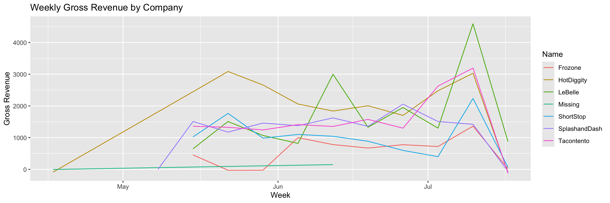
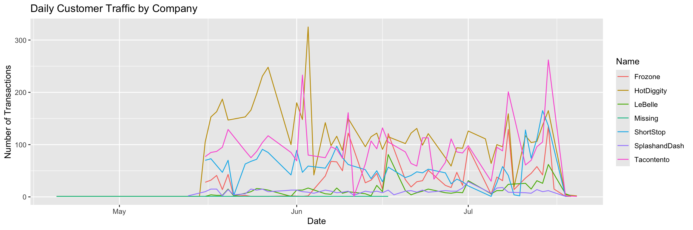
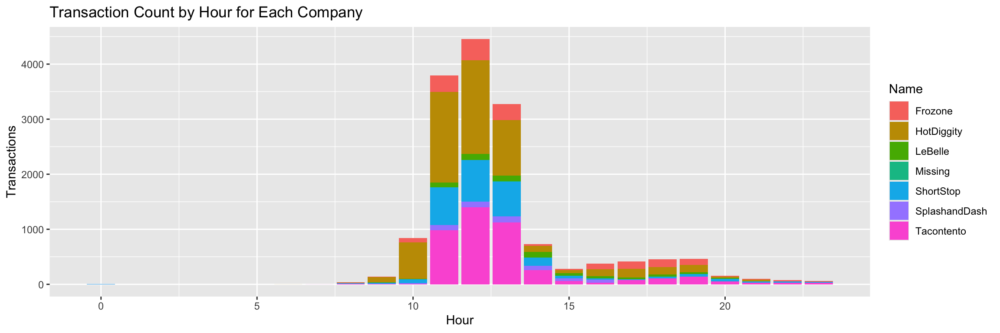

### Libraries


::: {.cell}

```{.r .cell-code}
library(tidyverse)
library(lubridate)
```
:::


## Data


::: {.cell}

```{.r .cell-code}
data <- read.csv("https://byuistats.github.io/M335/data/sales.csv")
data$Time <- ymd_hms(data$Time, tz = "UTC")
data <- data %>% mutate(Time_MST = with_tz(Time, "America/Denver"))
```
:::


# Data Aggregation 


::: {.cell}

```{.r .cell-code}
data_daily <- data %>%
  mutate(date = as_date(Time_MST)) %>%
  group_by(Name, date) %>%
  summarize(gross_revenue = sum(Amount), transactions = n())

data_weekly <- data %>%
  mutate(week = floor_date(Time_MST, "week")) %>%
  group_by(Name, week) %>%
  summarize(gross_revenue = sum(Amount), transactions = n())

data_monthly <- data %>%
  mutate(month = floor_date(Time_MST, "month")) %>%
  group_by(Name, month) %>%
  summarize(gross_revenue = sum(Amount), transactions = n())
```
:::


# Task - Visualization 


::: {.cell}

```{.r .cell-code}
ggplot(data_weekly, aes(x = week, y = gross_revenue, color = Name)) +
  geom_line() + 
  labs(title = "Weekly Gross Revenue by Company", x = "Week", y = "Gross Revenue")
```

::: {.cell-output-display}
{width=1152}
:::

```{.r .cell-code}
ggplot(data_daily, aes(x = date, y = transactions, color = Name)) +
  geom_line() +
  labs(title = "Daily Customer Traffic by Company", x = "Date", y = "Number of Transactions")
```

::: {.cell-output-display}
{width=1152}
:::

```{.r .cell-code}
data %>%
  mutate(hour = hour(Time_MST)) %>%
  group_by(Name, hour) %>%
  summarize(transactions = n()) %>%
  ggplot(aes(x = hour, y = transactions, fill = Name)) +
  geom_bar(stat = "identity") +
  labs(title = "Transaction Count by Hour for Each Company", x = "Hour", y = "Transactions")
```

::: {.cell-output-display}
{width=1152}
:::
:::


# Recommendation - Which Company Did Best?

Looking over the charts, we can see two companies perform relatively well. HotDiggity and Tacotento both stand out as the best performers in comparison to the rest of the companies. However, HotDiggity performs better in terms of Gross Revenue over time, and has more transactions overall. My recommendation would be HotDiggity as the company that did the best over the 3 months. 