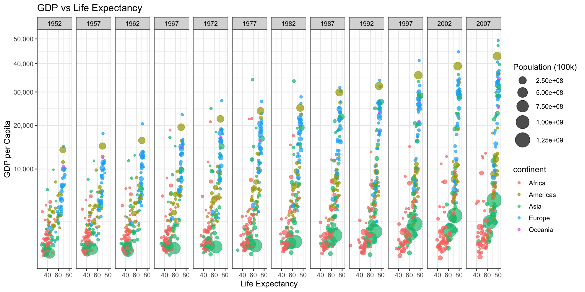

::: {.cell}

:::

::: {.cell}

```{.r .cell-code}
ggplot(gapminder_filtered, aes(x = lifeExp, y = gdpPercap, size = pop, color = continent)) +
  geom_point(alpha = 0.7) +
  scale_size(range = c(1, 10), name="Population (100k)") +
  scale_y_continuous(trans = "sqrt", labels = scales::comma) + 
  facet_wrap(~year, nrow=1) +
  theme_bw(base_size = 12) +
  labs(x = "Life Expectancy", y = "GDP per Capita", title = "GDP vs Life Expectancy") +
  theme(legend.position = "right")
```

::: {.cell-output-display}
{width=1152}
:::
:::
