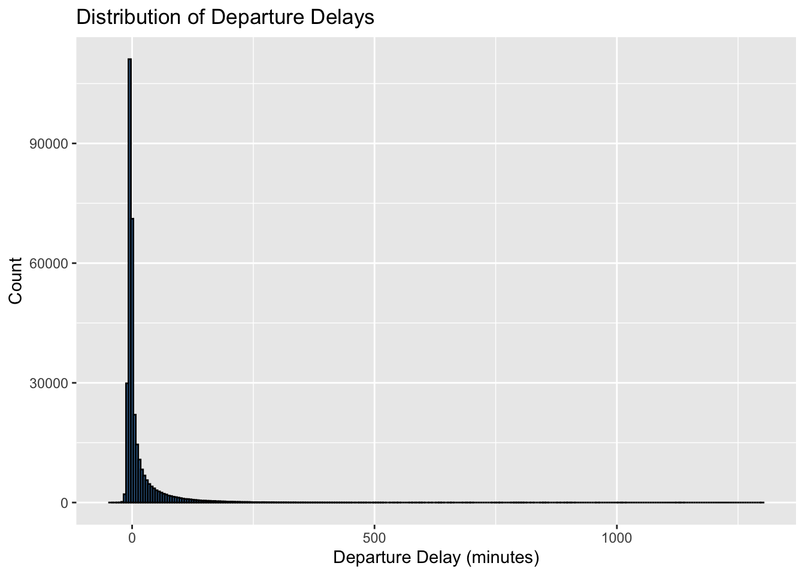
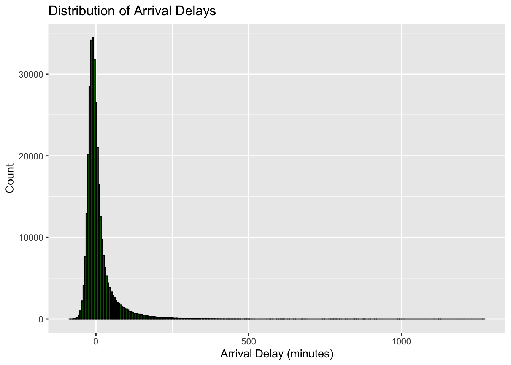
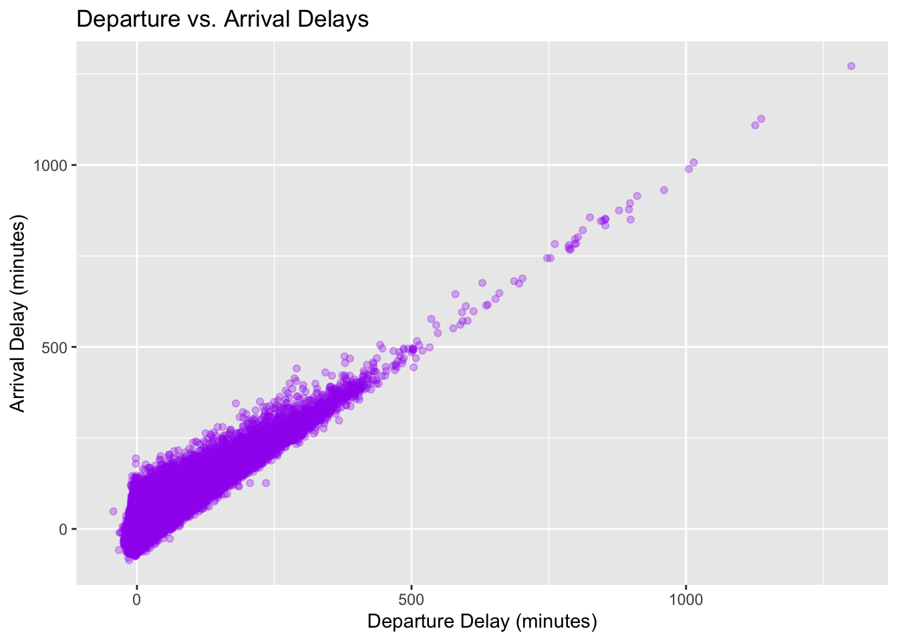

### Needed material


::: {.cell}

```{.r .cell-code}
# load packages
library(tidyverse)

# load flights data set
flights <- nycflights13::flights
```
:::


# Univariate Distributions


::: {.cell}

```{.r .cell-code}
# Distribution of Departure Delays
ggplot(flights, aes(x = dep_delay)) +
  geom_histogram(binwidth = 5, fill = "steelblue", color = "black") +
  labs(title = "Distribution of Departure Delays", x = "Departure Delay (minutes)", y = "Count")
```

::: {.cell-output-display}
{width=672}
:::

```{.r .cell-code}
# Distribution of Arrival Delays
ggplot(flights, aes(x = arr_delay)) +
  geom_histogram(binwidth = 5, fill = "darkgreen", color = "black") +
  labs(title = "Distribution of Arrival Delays", x = "Arrival Delay (minutes)", y = "Count")
```

::: {.cell-output-display}
{width=672}
:::
:::


# Bivariate Summary


::: {.cell}

```{.r .cell-code}
# Relationship between Departure and Arrival Delays
ggplot(flights, aes(x = dep_delay, y = arr_delay)) +
  geom_point(alpha = 0.3, color = "purple") +
  labs(title = "Departure vs. Arrival Delays", x = "Departure Delay (minutes)", y = "Arrival Delay (minutes)")
```

::: {.cell-output-display}
{width=672}
:::
:::


# Insights

The first two plots show the univariate distributions for both departure and arrival delays. We can see that both delay types have a heavily right-skewed distribution, with most flights experiencing little to no delay. However, a small number of flights face substantial delays, leading to long tails in the distribution.

The bivariate scatter plot illustrates the relationship between departure delays and arrival delays. There appears to be a positive relationship between the two, meaning that flights with longer departure delays tend to have longer arrival delays as well. However, the relationship is not perfectly linear, and there are some flights that manage to make up for delays or experience further delays in-flight.