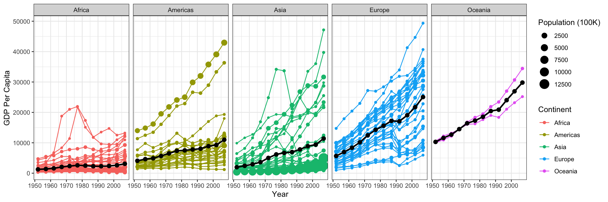

# Required Libraries


::: {.cell}

```{.r .cell-code}
library(tidyverse)
library(gapminder)

gapminder_filtered <- gapminder %>% 
  filter(country != "Kuwait")
```
:::


# Gapminder part 2 Plot


::: {.cell}

```{.r .cell-code}
NoKgapminder <- filter(gapminder, country != "Kuwait")
line <- NoKgapminder %>% 
  group_by(continent, year) %>% 
  summarise(average = weighted.mean(gdpPercap))
ggplot(data = NoKgapminder, mapping = aes(x = year, y = gdpPercap)) + 
  scale_x_continuous(breaks = seq(1950, 2000, by = 10)) +
  theme_bw() +
  labs(x = "Year",
       y = "GDP Per Capita",
       color = "Continent",
       size = "Population (100K)") +
  geom_point(aes(col = continent, size = pop/100000)) +
  geom_line(aes(color = continent, group = country)) +
  facet_grid(cols = vars(continent)) +
    geom_line(data = line, aes(x = year, y = average, size = 1), show.legend = FALSE) +
  geom_point(data = line, aes(x = year, y = average, size = 1000), show.legend = FALSE)
```

::: {.cell-output-display}
{width=1152}
:::
:::