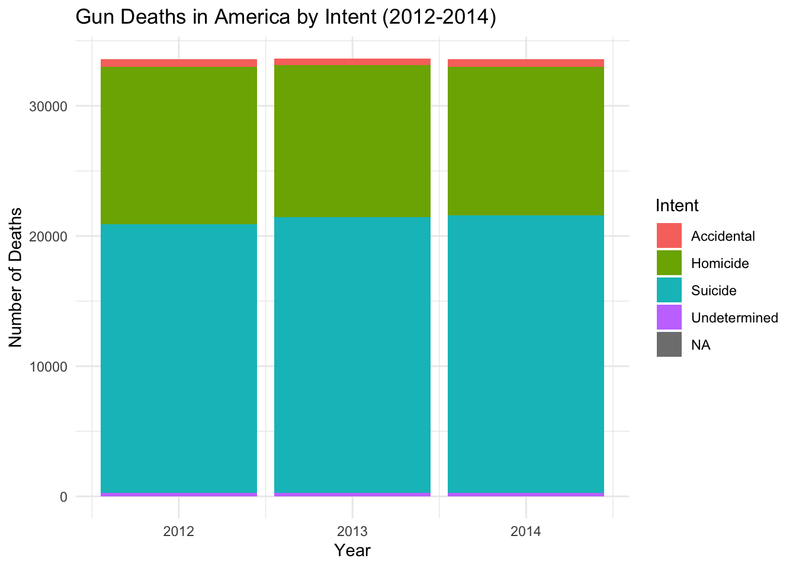
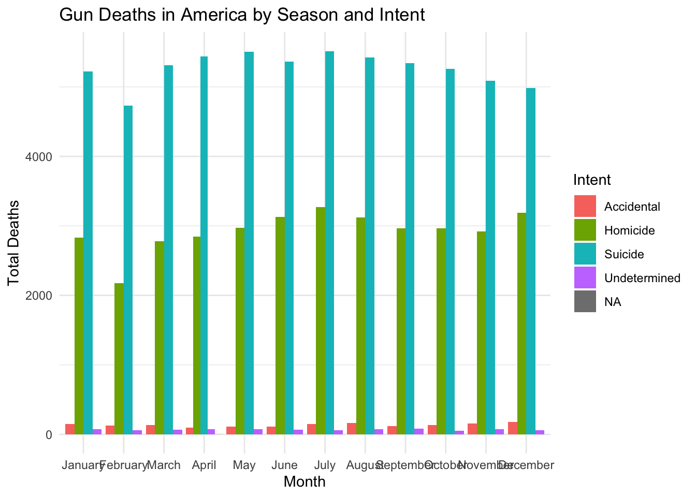
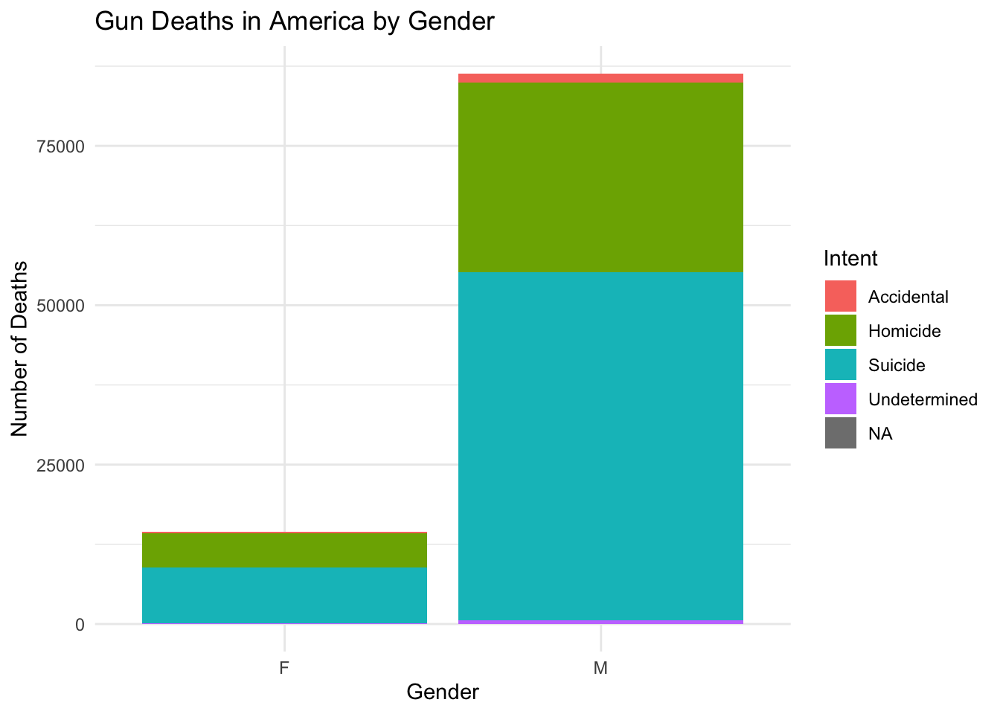
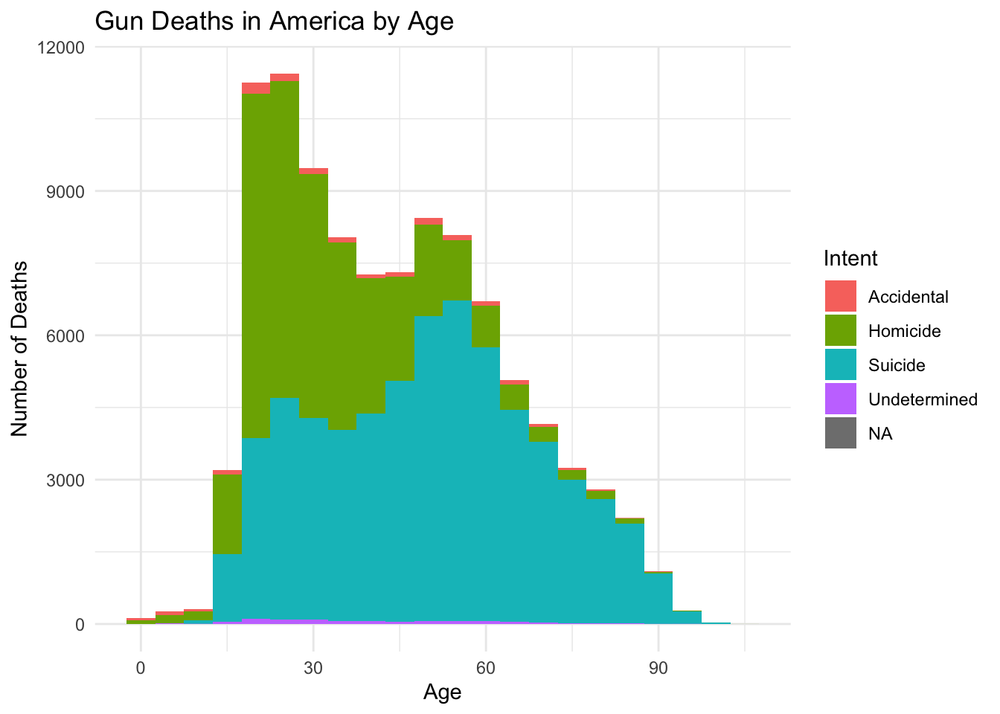

# Summary

The article "Gun Deaths in America" analyzes gun-related deaths between 2012 and 2014, focusing on factors such as the intent behind the death, whether it be homicides, suicides, or accidents, and demographic variables like age and gender. Suicides account for the majority of gun deaths, with the numbers surpassing homicides. Gun deaths tend to increase in warmer months, and males represent a large number of gun related deaths. 


# Libraries


::: {.cell}

```{.r .cell-code}
library(ggplot2)
library(dplyr)

url <- "https://raw.githubusercontent.com/fivethirtyeight/guns-data/refs/heads/master/full_data.csv"
gun_data <- read.csv(url)
```
:::


# Graphics

## Gun Deaths by Intent Over Time:
This bar plot shows the total number of gun deaths categorized by intent from 2012 to 2014. Suicides are the dominant cause, followed by homicides. The plot provides a clear year-by-year breakdown of the causes of gun deaths, revealing that gun suicides consistently outnumber homicides.


::: {.cell}

```{.r .cell-code}
gun_data$year <- as.numeric(substr(gun_data$year, 1, 4))

ggplot(gun_data, aes(x = year, fill = intent)) +
  geom_bar(position = "stack") +
  labs(title = "Gun Deaths in America by Intent (2012-2014)",
       x = "Year", y = "Number of Deaths",
       fill = "Intent") +
  theme_minimal()
```

::: {.cell-output-display}
{width=672}
:::

```{.r .cell-code}
gun_data$month <- factor(gun_data$month, levels = 1:12, labels = c("January", "February", "March", "April", "May", "June", "July", "August", "September", "October", "November", "December"))

seasonal_data <- gun_data %>%
  group_by(month, intent) %>%
  summarise(total_deaths = n())
```
:::


## Gun Deaths by Season and Intent:
This plot shows the number of gun deaths by month and intent. The data suggest an increase in gun deaths during the summer months, especially in July and August, which may help the client target advertising for summer-related public safety campaigns.


::: {.cell}

```{.r .cell-code}
ggplot(seasonal_data, aes(x = month, y = total_deaths, fill = intent)) +
  geom_bar(stat = "identity", position = "dodge") +
  labs(title = "Gun Deaths in America by Season and Intent",
       x = "Month", y = "Total Deaths", fill = "Intent") +
  theme_minimal()
```

::: {.cell-output-display}
{width=672}
:::
:::


## Gun Deaths by Gender:
This plot illustrates the gender difference in gun deaths, with males accounting for the large majority of gun deaths across all categories. This insight is important for developing more focused messaging toward male demographics.


::: {.cell}

```{.r .cell-code}
ggplot(gun_data, aes(x = sex, fill = intent)) +
  geom_bar(position = "stack") +
  labs(title = "Gun Deaths in America by Gender",
       x = "Gender", y = "Number of Deaths", fill = "Intent") +
  theme_minimal()
```

::: {.cell-output-display}
{width=672}
:::
:::


## Gun deaths by Age:
The histogram displays the distribution of gun deaths across age all groups. Suicides are most prevalent in middle-aged and older individuals, while homicides are more common among younger adults. This information could help inform different advertising strategies aimed at different age groups throughout the year.


::: {.cell}

```{.r .cell-code}
ggplot(gun_data, aes(x = age, fill = intent)) +
  geom_histogram(binwidth = 5, position = "stack") +
  labs(title = "Gun Deaths in America by Age",
       x = "Age", y = "Number of Deaths", fill = "Intent") +
  theme_minimal()
```

::: {.cell-output-display}
{width=672}
:::
:::