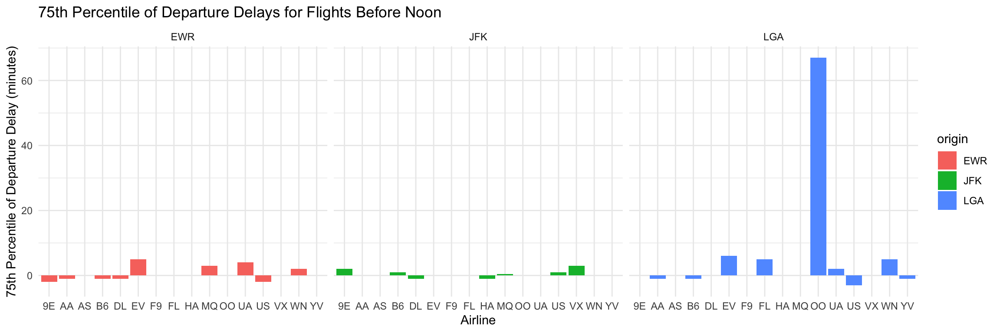

# Required Libraries


::: {.cell}

```{.r .cell-code}
library(nycflights13)
library(dplyr)
library(ggplot2)
```
:::


# Case Study


## Question 1: Which airline has the lowest 75th percentile of departure delay for flights scheduled to leave earlier than noon at JFK, EWR, and LGA?


::: {.cell}

```{.r .cell-code}
flights_before_noon <- flights %>%
  filter(sched_dep_time < 1200) %>%
  group_by(origin, carrier) %>%
  summarise(
    p75_dep_delay = quantile(dep_delay, 0.75, na.rm = TRUE)
  ) %>%
  arrange(origin, p75_dep_delay)

 ggplot(flights_before_noon, aes(x = carrier, y = p75_dep_delay, fill = origin)) +
  geom_bar(stat = "identity", position = "dodge") +
  labs(
    title = "75th Percentile of Departure Delays for Flights Before Noon",
    x = "Airline",
    y = "75th Percentile of Departure Delay (minutes)"
  ) +
  facet_wrap(~ origin) +
  theme_minimal()
```

::: {.cell-output-display}
{width=1152}
:::
:::

EWR: Alaska Airlines (AS) has the lowest 75th percentile of departure delays.
JFK: Endeavor Air (9E) has the lowest 75th percentile of departure delays.
LGA: Delta Airlines (DL) has the lowest 75th percentile of departure delays.

## Question 2: Which origin airport is best to minimize my chances of a late arrival when I am using Delta Airlines?


::: {.cell}

```{.r .cell-code}
delta_flights <- flights %>%
  filter(carrier == "DL") %>%
  group_by(origin) %>%
  summarise(mean_arr_delay = mean(arr_delay, na.rm = TRUE),
            median_arr_delay = median(arr_delay, na.rm = TRUE),
            flights_count = n()) %>%
  arrange(mean_arr_delay)

ggplot(delta_flights, aes(x = origin, y = mean_arr_delay, fill = origin)) +
  geom_bar(stat = "identity") +
  labs(title = "Mean Arrival Delays for Delta Airlines by Origin Airport",
       x = "Origin Airport", y = "Mean Arrival Delay (minutes)") +
  theme_minimal()
```

::: {.cell-output-display}
{width=1152}
:::
:::

Based on the above bar chart, we can conclude that JFK has the lowest mean arrival delay (it's actually in the negatives too!) so if you want to minimize your chances of being late, it is best to go with JFK when using Delta Airlines. 

## Question 3: Which destination airport is the worst airport for arrival delays?


::: {.cell}

```{.r .cell-code}
worst_destinations <- flights %>%
  group_by(dest) %>%
  summarise(
    mean_arr_delay = mean(arr_delay, na.rm = TRUE),
    median_arr_delay = median(arr_delay, na.rm = TRUE),
    num_flights = n()
  ) %>%
  arrange(desc(mean_arr_delay))

top_worst_destinations <- worst_destinations %>%
  top_n(10, mean_arr_delay)

flights_top_destinations <- flights %>%
  filter(dest %in% top_worst_destinations$dest)

ggplot(flights_top_destinations, aes(x = reorder(dest, arr_delay), y = arr_delay)) +
  geom_jitter(width = 0.2, alpha = 0.3, color = "blue") + 
  stat_summary(fun = mean, geom = "point", color = "red", size = 3, shape = 15) + 
  labs(
    title = "Top 10 Worst Destination Airports by Arrival Delays",
    x = "Destination Airport",
    y = "Arrival Delay (minutes)"
  ) +
  coord_flip() +
  theme_minimal()
```

::: {.cell-output-display}
{width=1152}
:::
:::


Reviewing the plot above displaying individual flights across different airports, we are able to see that the destination airport with the worst arrival delays is RIC airport with one flight recording a delay close to a 450 minute delay. CAK is behind RIC with one flight being over a 400 minute delay. 