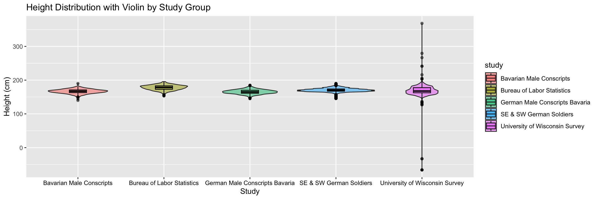
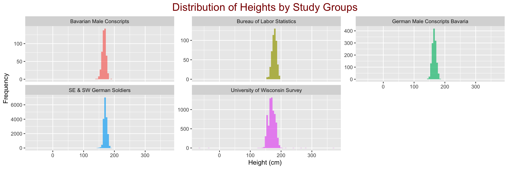

### Libraries


::: {.cell}

```{.r .cell-code}
library(haven)
library(foreign)
library(dplyr)
library(ggplot2)
library(tidyverse)
library(downloader)
library(readxl)
library(curl)
```
:::


### Data Sets


::: {.cell}

```{.r .cell-code}
# German male conscripts in Bavaria, 19th century: Stata format
download("https://byuistats.github.io/M335/data/heights/germanconscr.dta", dest="gercons.dta", mode="wb")
df_gecons <- read_dta("gercons.dta")

# Heights of Bavarian male conscripts, 19th century: Stata format
download("https://byuistats.github.io/M335/data/heights/germanprison.dta", dest="gerpri.dta", mode="wb")
df_gerpri <- read_dta("gerpri.dta")

# Heights of south-east and south-west German soldiers born in the 18th century: DBF format
download("https://byuistats.github.io/M335/data/heights/Heights_south-east.zip", dest="heights.zip", mode="wb")
unzip("heights.zip")
df_heights <- read.dbf("B6090.DBF")

# Bureau of Labor Statistics Height Data: CSV format
download("https://raw.githubusercontent.com/hadley/r4ds/main/data/heights.csv", dest="bureau.csv", mode="wb")
df_bureau <- read_csv("bureau.csv")

# University of Wisconsin National Survey Data: SPSS format
curl_download("http://www.ssc.wisc.edu/nsfh/wave3/NSFH3%20Apr%202005%20release/main05022005.sav", destfile = "university.sav")
df_university <- read_sav("university.sav")
```
:::


# Data Wrangling - Case Study


::: {.cell}

```{.r .cell-code}
# Wrangle German Male Conscripts
data1 <- df_gecons %>%
  rename(height.cm = "height") %>%
  mutate(height.in = height.cm / 2.54,
         birth_year = bdec) %>%
  select(birth_year, height.in, height.cm) %>%
  mutate(study = "German Male Conscripts Bavaria")

# Wrangle Bavarian Male Conscripts
data2 <- df_gerpri %>%
  rename(height.cm = "height") %>%
  mutate(height.in = height.cm / 2.54,
         birth_year = bdec) %>%
  select(birth_year, height.in, height.cm) %>%
  mutate(study = "Bavarian Male Conscripts")

# Wrangle South-East and South-West German Soldiers
data3 <- df_heights %>%
  select(GEBJ, CMETER) %>%
  rename(birth_year = GEBJ,
         height.cm = CMETER) %>%
  mutate(height.in = height.cm / 2.54) %>%
  select(birth_year, height.in, height.cm) %>%
  mutate(study = "SE & SW German Soldiers")

# Wrangle Bureau of Labor Statistics Height Data
data4 <- df_bureau %>%
  filter(sex == "male") %>%
  mutate(birth_year = 1950,
         height.in = height) %>%
  mutate(height.cm = height.in * 2.54) %>%
  select(birth_year, height.in, height.cm) %>%
  mutate(study = "Bureau of Labor Statistics")

# Wrangle University of Wisconsin National Survey Data
data5 <- df_university %>%
  select(DOBY, RT216F, RT216I) %>%
  mutate(birth_year = DOBY + 1900,
         height.in = (RT216F * 12) + RT216I,
         height.cm = height.in * 2.54) %>%
  select(birth_year, height.in, height.cm) %>%
  mutate(study = "University of Wisconsin Survey")

# Combine all datasets
combined_data <- bind_rows(data1, data2, data3, data4, data5)
```
:::


# Case Study Responses

How does the story told by this data compare to the story told by the data in the previous task? Do they agree or do they contradict? If they contradict, reason through the contradiction and try to make sense of it.

- The data from this case study and the previous one tell a similar story about heights. Both show trends in how tall people are, but they might have different results based on the groups studied. If there are contradictions, it could be because of differences in the time periods or locations of the studies.

How would you respond to the assertion that humans are getting taller over time based on the datasets in these two tasks involving height?

- I would say that the data suggests that humans have gotten taller over time, but it depends on which groups we look at. Some groups may show a clear increase, while others might not. So, while there is a trend of taller heights in general, it's not the same for everyone.

# Case Study - Visualizations


::: {.cell}

```{.r .cell-code}
# Plot heights across different studies
ggplot(data = combined_data) +
  geom_point(mapping = aes(x = birth_year, y = height.in, color = study), size = 3) +
  theme_minimal() +
  labs(title = "Heights of All Individuals",
       x="Birth Year",
       y= "Height (inches)") +
  theme(plot.title = element_text(hjust = 0.5, color = "darkblue", size = 18),
        axis.text.x = element_text(angle = , vjust = 0.5, hjust = 1, color = "purple"),
        axis.text.y = element_text(color = "green"))
```

::: {.cell-output-display}
{width=1152}
:::

```{.r .cell-code}
# Height Distribution with Violin and Boxplot Overlay by Study Group
ggplot(combined_data, aes(x = study, y = height.cm, fill = study)) +
  geom_violin(alpha = 0.5) +
  geom_boxplot(width = 0.2, color = "black", alpha = 0.5) +
  labs(title = "Height Distribution with Violin by Study Group",
       x = "Study", y = "Height (cm)") +
  theme(axis.text.x = element_text(color = "black"))
```

::: {.cell-output-display}
{width=1152}
:::

```{.r .cell-code}
# Histogram of Heights by Study Group
ggplot(combined_data, aes(x = height.cm, fill = study)) +
  geom_histogram(binwidth = 5, position = "dodge", alpha = 0.7) +
  labs(title = "Distribution of Heights by Study Groups",
       x = "Height (cm)",
       y = "Frequency") +
  facet_wrap(~ study, scales = "free_y") +
  theme(legend.position = "none",
        plot.title = element_text(hjust = 0.5, color = "darkred", size = 18))
```

::: {.cell-output-display}
{width=1152}
:::
:::

## Data Wrangling Process

In this case study, we downloaded height data from different sources like Stata, DBF, CSV, and SPSS. We opened each dataset in R, renamed some columns for better understanding, and added new columns for height in inches and birth year. We removed unnecessary columns and labeled each dataset. Finally, we combined all the cleaned datasets into one data frame called combined_data, which has consistent columns for birth year, height in centimeters and inches, and study source, making it ready for analysis and visualization.
