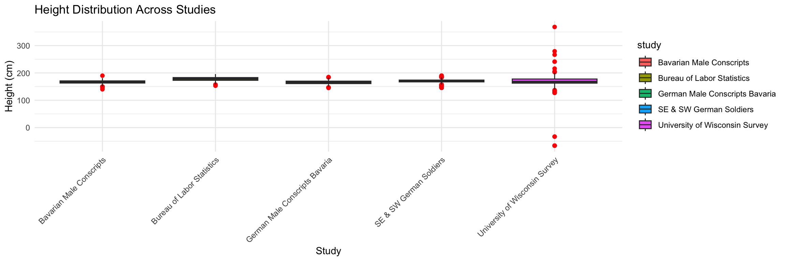
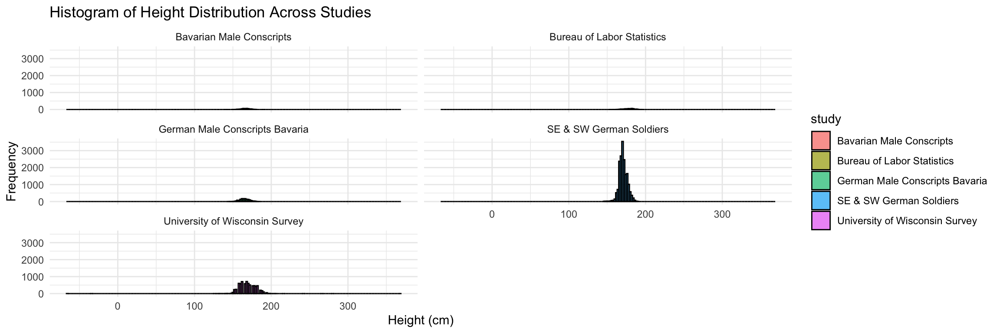

### Libraries


::: {.cell}

```{.r .cell-code}
library(foreign)
library(dplyr)
library(ggplot2)
library(tidyverse)
library(readxl)
library(curl)
library(haven)
```
:::


### Data Sets


::: {.cell}

```{.r .cell-code}
df_gecons <- read_dta("gercons.dta")

df_gerpri <- read_dta("gerpri.dta")

df_heights <- read.dbf("B6090.DBF")

df_bureau <- read_csv("bureau.csv")

df_university <- read_sav("university.sav")
```
:::


# Combine Data


::: {.cell}

```{.r .cell-code}
df_gecons <- df_gecons %>%
  rename(height.cm = "height") %>%
  mutate(height.in = height.cm / 2.54,
         birth_year = bdec) %>%
  select(birth_year, height.in, height.cm) %>%
  mutate(study = "German Male Conscripts Bavaria")

df_gerpri <- df_gerpri %>%
  rename(height.cm = "height") %>%
  mutate(height.in = height.cm / 2.54,
         birth_year = bdec) %>%
  select(birth_year, height.in, height.cm) %>%
  mutate(study = "Bavarian Male Conscripts")

df_heights <- df_heights %>%
  select(GEBJ, CMETER) %>%
  rename(birth_year = GEBJ,
         height.cm = CMETER) %>%
  mutate(height.in = height.cm / 2.54) %>%
  select(birth_year, height.in, height.cm) %>%
  mutate(study = "SE & SW German Soldiers")

df_bureau <- df_bureau %>%
   filter(sex == "male") %>%
  mutate(birth_year = 1950,
         height.in = height) %>%
  mutate(height.cm = height.in * 2.54) %>%
  select(birth_year, height.in, height.cm) %>%
  mutate(study = "Bureau of Labor Statistics")

df_university <- df_university %>%
  select(DOBY, RT216F, RT216I) %>%
  mutate(birth_year = DOBY + 1900,
         height.in = (RT216F * 12) + RT216I,
         height.cm = height.in * 2.54) %>%
  select(birth_year, height.in, height.cm) %>%
  mutate(study = "University of Wisconsin Survey")

combined_df <- bind_rows(df_gecons, df_gerpri, df_heights, df_bureau, df_university)
```
:::


# Case Study Visualizations


::: {.cell}

```{.r .cell-code}
ggplot(combined_df, aes(x = study, y = height.cm, fill = study)) +
  geom_boxplot(outlier.colour = "red", outlier.shape = 16, outlier.size = 2) +
  labs(title = "Height Distribution Across Studies",
       x = "Study",
       y = "Height (cm)") +
  theme_minimal() +
  theme(axis.text.x = element_text(angle = 45, hjust = 1))
```

::: {.cell-output-display}
{width=1152}
:::

```{.r .cell-code}
ggplot(combined_df, aes(x = height.cm, fill = study)) +
  geom_histogram(binwidth = 2, position = "identity", alpha = 0.7, color = "black") +
  labs(title = "Histogram of Height Distribution Across Studies",
       x = "Height (cm)",
       y = "Frequency") +
  theme_minimal() +
  facet_wrap(~ study, ncol = 2)
```

::: {.cell-output-display}
{width=1152}
:::
:::


# Case Study Responses

## Data Wrangling Summary

To get the data ready for analysis, I worked with five different datasets from various sources like Stata, DBF, CSV, and SPSS. Each dataset needed some changes so they could be a similar structure. I renamed columns to keep things consistent and converted height measurements from centimeters to inches. For the Bureau of Labor Statistics dataset, I filtered the data to include only male individuals and set the birth year to 1950 since it wasn’t provided. I also picked out the most important columns—birth year, height in inches and centimeters, and the study names—so that I could easily compare them later. This careful work helped me create a tidy dataset that shows individual heights from each study and allows for better comparisons across different time periods.

## Additional Responses

The data from this case study and the previous one tell a similar story about heights. They're showing trends in how tall people are, but if we look at a different group then they won't exactly have the same results. It's different for everyone, it's different for the time period, the region, and the amount of nutrition they are intaking. 

Reviewing the data and the visualizations that have been create using ggplot, it does show a height increase overtime. However, that isn't the same story for every group within our data. Different groups are showing different trends in their heights. 


