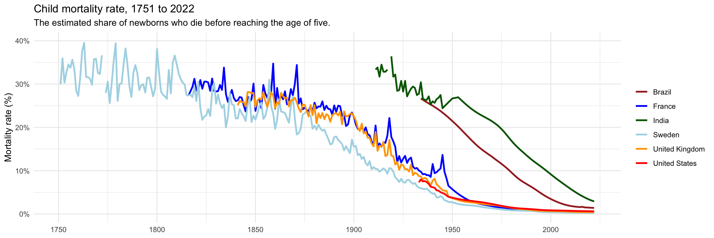

## Snapshot of the Data Set

["Under-five mortality" - Our World in Data](https://ourworldindata.org/grapher/child-mortality?time=earliest..latest)


## Libraries


::: {.cell}

```{.r .cell-code}
library(ggplot2)
library(dplyr)
library(readr)
library(scales)
```
:::


## Our World in Data set


::: {.cell}

```{.r .cell-code}
data <- read_csv("child-mortality.csv")
```
:::


# Case Study Visualization


::: {.cell}

```{.r .cell-code}
countries <- c("India", "Brazil", "United States", "United Kingdom", "France", "Sweden")
filtered_data <- data %>% filter(Entity %in% countries)

ggplot(filtered_data, aes(x = Year, y = `Under-five mortality rate`, color = Entity)) +
  geom_line(size = 1) +
  scale_color_manual(values = c("India" = "darkgreen", 
                                "Brazil" = "brown", 
                                "United States" = "red", 
                                "United Kingdom" = "orange", 
                                "France" = "blue", 
                                "Sweden" = "lightblue")) +
  scale_y_continuous(labels = percent_format(scale = 1), limits = c(0, 40)) +
  labs(title = "Child mortality rate, 1751 to 2022",
       subtitle = "The estimated share of newborns who die before reaching the age of five.",
       x = NULL, y = "Mortality rate (%)") +
  theme_minimal() +
  theme(legend.title = element_blank())
```

::: {.cell-output-display}
{width=1152}
:::
:::