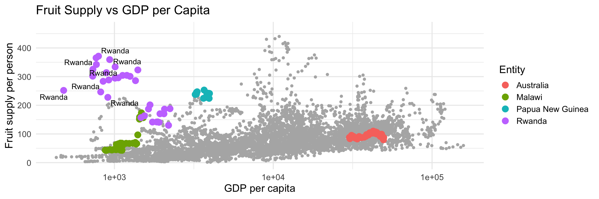

## Libraries


::: {.cell}

```{.r .cell-code}
library(ggplot2)
library(dplyr)
library(ggrepel)
library(tidyverse)
library(ggthemes)
library(readr)
library(knitr)
```
:::


## Data Set


::: {.cell}

```{.r .cell-code}
data <- read.csv('W05-Data.csv')
```
:::


# Task


::: {.cell}

```{.r .cell-code}
colnames(data) <- c("Entity", "Code", "Year", "Fruit_supply_kg", "GDP_per_capita", "Continent")

ggplot(data, aes(x = GDP_per_capita, y = Fruit_supply_kg)) +
  geom_point(color = "steelblue") +
  scale_x_log10() +  
  labs(x = "GDP per capita", y = "Fruit supply per person") +
  theme_minimal()
```

::: {.cell-output-display}
{width=1152}
:::

```{.r .cell-code}
highlight_countries <- c("Rwanda", "Papua New Guinea", "Australia", "Malawi")

ggplot(data, aes(x = GDP_per_capita, y = Fruit_supply_kg)) +
  geom_point(color = "grey70") +
  geom_point(data = filter(data, Entity %in% highlight_countries), aes(color = Entity), size = 4) +
  scale_x_log10() +
  labs(x = "GDP per capita", y = "Fruit supply per person") +
  theme_minimal()
```

::: {.cell-output-display}
{width=1152}
:::

```{.r .cell-code}
ggplot(data, aes(x = GDP_per_capita, y = Fruit_supply_kg)) +
  geom_point(color = "grey70") +
  geom_point(data = filter(data, Entity %in% highlight_countries), aes(color = Entity), size = 4) +
  geom_text_repel(data = filter(data, Entity %in% highlight_countries), aes(label = Entity)) +
  scale_x_log10() +
  labs(title = "Fruit Supply vs GDP per Capita",
       x = "GDP per capita", 
       y = "Fruit supply per person") +
  theme_minimal(base_size = 15)
```

::: {.cell-output-display}
{width=1152}
:::

```{.r .cell-code}
ggplot(data, aes(x = GDP_per_capita, y = Fruit_supply_kg)) +
  geom_point(color = "grey70") +
  geom_point(data = filter(data, Continent == "Africa"), color = "purple", size = 4) +
  scale_x_log10() +
  labs(title = "Fruit Supply vs GDP per Capita (Africa Highlighted)",
       x = "GDP per capita", 
       y = "Fruit supply per person") +
  theme_minimal(base_size = 15)
```

::: {.cell-output-display}
{width=1152}
:::
:::


# Insights Gained

Throughout the course of this task I have been able to see the reliability of scatter plots, especially with the use of libraries within R such as ggplot which allow me to create an elegant chart displaying and visualization data that pertains to different regions. I learned how to use labels on my plots in a more effective manner to display the meaning behind my data visualization. 