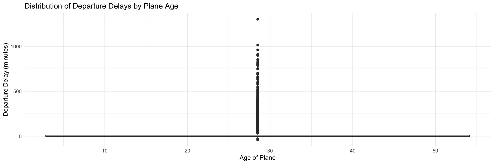
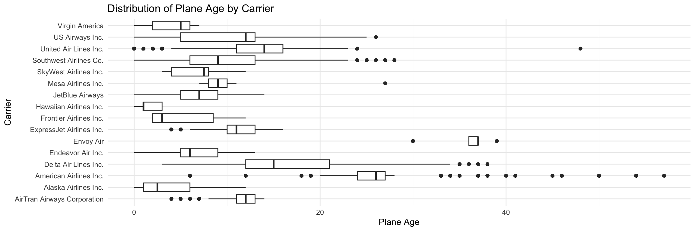
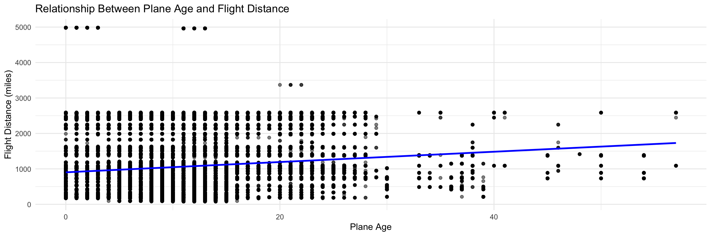

### Libraries


::: {.cell}

```{.r .cell-code}
library(nycflights13)
library(dplyr)
library(ggplot2)
```
:::


## Flights and Planes Tibbles


::: {.cell}

```{.r .cell-code}
flights_planes <- left_join(flights, planes, by = "tailnum")
```
:::


# Task Visualization


::: {.cell}

```{.r .cell-code}
flights_planes <- flights_planes %>%
  mutate(flight_year = as.numeric(format(time_hour, "%Y")),  
         age = flight_year - year.y)

flights_planes <- flights_planes %>%
  filter(!is.na(age) & age >= 0)

ggplot(flights_planes, aes(x = age, y = dep_delay)) +
  geom_boxplot() +
  labs(title = "Distribution of Departure Delays by Plane Age", x = "Age of Plane", y = "Departure Delay (minutes)") +
  theme_minimal()
```

::: {.cell-output-display}
{width=1152}
:::

```{.r .cell-code}
flights_planes <- flights_planes %>%
  mutate(age_group = case_when(
    age <= 10 ~ "0-10",
    age <= 20 ~ "11-20",
    age <= 30 ~ "21-30",
    age > 30 ~ ">30"
  ))

flights_planes_airlines <- left_join(flights_planes, airlines, by = "carrier")

ggplot(flights_planes_airlines, aes(x = name, y = age)) +
  geom_boxplot() +
  coord_flip() +
  labs(title = "Distribution of Plane Age by Carrier", x = "Carrier", y = "Plane Age") +
  theme_minimal()
```

::: {.cell-output-display}
{width=1152}
:::

```{.r .cell-code}
ggplot(flights_planes_airlines, aes(x = age, y = distance)) +
  geom_point(alpha = 0.5) +
  geom_smooth(method = "lm", se = FALSE, color = "blue") +
  labs(title = "Relationship Between Plane Age and Flight Distance", x = "Plane Age", y = "Flight Distance (miles)") +
  theme_minimal()
```

::: {.cell-output-display}
{width=1152}
:::
:::
