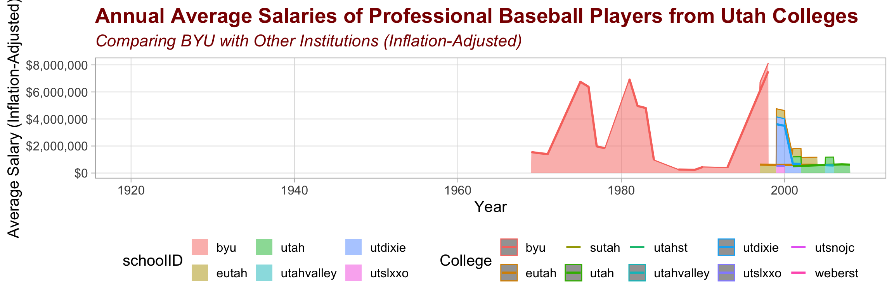

### Libraries


::: {.cell}

```{.r .cell-code}
library(Lahman)
library(priceR)
library(dplyr)
library(ggplot2)
library(tidyr)
```
:::


## Load Data Sets


::: {.cell}

```{.r .cell-code}
data("People")
data("Salaries")
data("CollegePlaying")
```
:::


# Merging and Filtering Data


::: {.cell}

```{.r .cell-code}
average_salaries <- Salaries %>%
  group_by(playerID) %>%
  summarise(avg_ann_sal = mean(salary), .groups = 'drop')

baseball_data <- CollegePlaying %>%
  left_join(People %>% select(playerID, nameFirst, nameLast), by = "playerID") %>%
  left_join(average_salaries, by = "playerID") %>%
  left_join(Schools, by = "schoolID") %>%
  mutate(name_full = paste(nameFirst, nameLast)) %>%
  filter(state == "UT") %>%
  select(yearID, schoolID, name_full, avg_ann_sal)

baseball_data_adjusted <- baseball_data %>%
  group_by(schoolID, yearID) %>%
  summarise(avg_ann_sal = mean(avg_ann_sal, na.rm = TRUE), .groups = 'drop') %>%
  mutate(adjusted_earnings = adjust_for_inflation(price = avg_ann_sal, 
                                                  from_date = yearID, 
                                                  country = "US", 
                                                  to_date = 2021))
```

::: {.cell-output .cell-output-stdout}

```
Generating URL to request all 296 results
Retrieving inflation data for US 
Generating URL to request all 64 results
```


:::
:::


# Case Study - Visualization 


::: {.cell}

```{.r .cell-code}
reshaped_data <- baseball_data_adjusted %>%
  pivot_longer(cols = adjusted_earnings, names_to = "Earnings_Type", values_to = "Value")

visual2 <- ggplot(reshaped_data, aes(x = yearID, y = Value, color = schoolID)) +
  geom_area(aes(fill = schoolID), alpha = 0.5) +  
  geom_line(size = 1) +
  labs(title = "Annual Average Salaries of Professional Baseball Players from Utah Colleges",
       subtitle = "Comparing BYU with Other Institutions (Inflation-Adjusted)",
       y = "Average Salary (Inflation-Adjusted)",
       x = "Year",
       color = "College") +
  theme_light(base_size = 15) +  
  scale_y_continuous(labels = scales::dollar_format()) +
  theme(panel.grid.minor = element_blank(),  
        plot.title = element_text(color = "darkred", face = "bold", size = 20),
        plot.subtitle = element_text(color = "darkred", face = "italic", size = 16),
        legend.position = "bottom") 

visual2
```

::: {.cell-output-display}
{width=1152}
:::
:::


# Summary of findings

This visualization of the average salaries of Professional Baseball players from different Utah colleges shows how dominant BYU is in comparison to the other schools. It also appears the BYU has had a longer history of recorded salaries of baseball players. 

