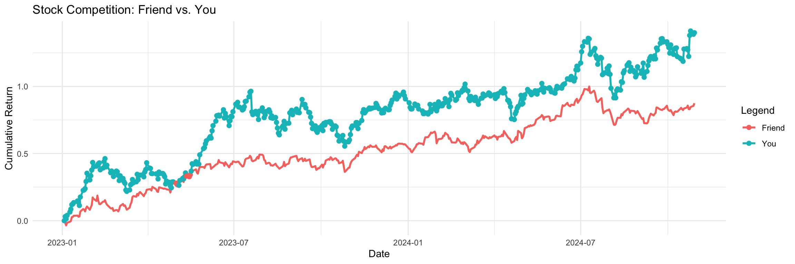
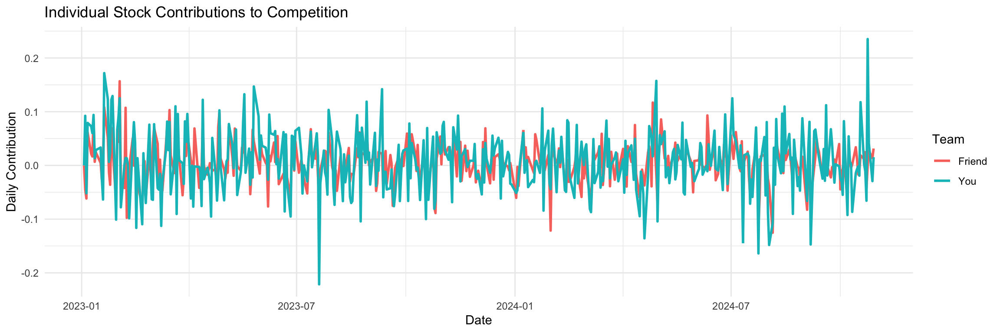

### Libraries


::: {.cell}

```{.r .cell-code}
library(tidyquant)
library(tidyverse)
```
:::


### Stocks


::: {.cell}

```{.r .cell-code}
friend_stocks <- c("AAPL", "MSFT", "GOOGL") 
your_stocks <- c("TSLA", "AMZN", "NFLX")    
```
:::


# Case Study 


::: {.cell}

```{.r .cell-code}
start_date <- "2023-01-01"
end_date <- Sys.Date()

stock_data <- tq_get(c(friend_stocks, your_stocks), from = start_date, to = end_date)

daily_returns <- stock_data %>%
  group_by(symbol) %>%
  tq_transmute(select = adjusted, mutate_fun = periodReturn, period = "daily", col_rename = "daily_return") %>%
  ungroup()

cumulative_returns <- daily_returns %>%
  group_by(symbol) %>%
  mutate(cumulative_return = cumprod(1 + daily_return) - 1) %>%  
  ungroup() %>%
  mutate(team = ifelse(symbol %in% friend_stocks, "Friend", "You")) %>%
  group_by(date, team) %>%
  summarize(total_return = mean(cumulative_return, na.rm = TRUE), .groups = 'drop') %>%
  pivot_wider(names_from = team, values_from = total_return) %>%
  mutate(winner = ifelse(Friend > You, "Friend", "You")) 

ggplot(cumulative_returns, aes(x = date)) +
  geom_line(aes(y = Friend, color = "Friend"), size = 1) +
  geom_line(aes(y = You, color = "You"), size = 1) +
  geom_point(aes(y = ifelse(winner == "Friend", Friend, You), color = winner), size = 2) +
  labs(title = "Stock Competition: Friend vs. You",
       x = "Date", y = "Cumulative Return",
       color = "Legend") +
  theme_minimal()
```

::: {.cell-output-display}
{width=1152}
:::

```{.r .cell-code}
individual_contributions <- daily_returns %>%
  mutate(team = ifelse(symbol %in% friend_stocks, "Friend", "You")) %>%
  group_by(date, team) %>%
  summarize(contribution = sum(daily_return, na.rm = TRUE), .groups = 'drop') %>%
  pivot_wider(names_from = team, values_from = contribution) %>%
  mutate(winner = ifelse(Friend > You, "Friend", "You"))

ggplot(individual_contributions, aes(x = date)) +
  geom_line(aes(y = Friend, color = "Friend"), size = 1, na.rm = TRUE) +
  geom_line(aes(y = You, color = "You"), size = 1, na.rm = TRUE) +
  labs(title = "Individual Stock Contributions to Competition",
       x = "Date", y = "Daily Contribution",
       color = "Team") +
  theme_minimal()
```

::: {.cell-output-display}
{width=1152}
:::
:::


# Summary of Case Study

In this Case Study, I selected three technology stocks for my friend—Apple (AAPL), Microsoft (MSFT), and Google (GOOGL)—and three for myself—Tesla (TSLA), Amazon (AMZN), and Netflix (NFLX). Using the tidyquant library, I pulled the price performance data for these six stocks from January 1, 2023, to the current date.

The first visualization shows the cumulative returns of both teams daily, highlighting the competition's outcome over time. Points are added to show the leading team on each day. The second visualization shows the individual contribution. It appears that my team (blue) is leading over my friends team (red) when we look at the cumulative return. 
