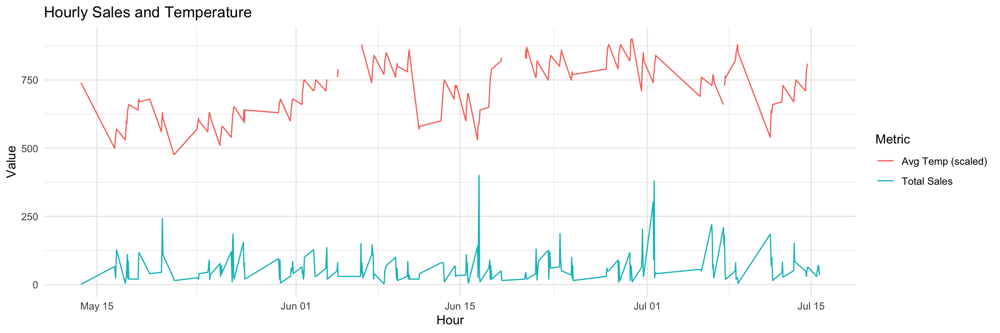
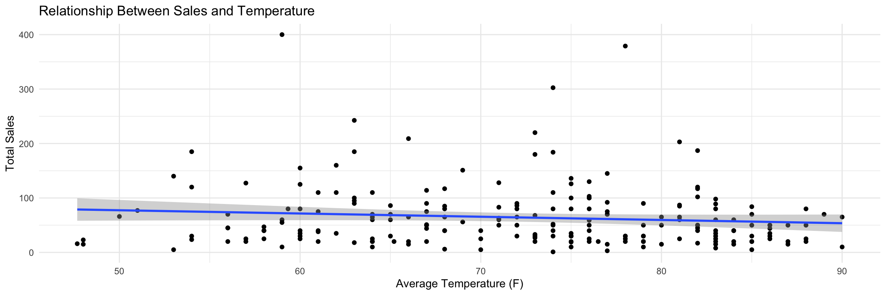

### Libraries


::: {.cell}

```{.r .cell-code}
library(tidyverse)
library(lubridate)
library(riem)
```
:::


## Data Sets


::: {.cell}

```{.r .cell-code}
carwash_data <- read_csv("https://byuistats.github.io/M335/data/carwash.csv")

carwash_data <- carwash_data %>%
  mutate(local_time = with_tz(ymd_hms(time), tzone = "America/Denver"))
```
:::


# Task - Car Wash


::: {.cell}

```{.r .cell-code}
carwash_data <- carwash_data %>%
  filter(amount > 0)
sum(is.na(carwash_data))
```

::: {.cell-output .cell-output-stdout}

```
[1] 0
```


:::

```{.r .cell-code}
carwash_data <- carwash_data %>%
  mutate(hour = ceiling_date(local_time, unit = "hour"))
hourly_sales <- carwash_data %>%
  group_by(hour) %>%
  summarize(total_sales = sum(amount))

date_start <- as.Date(min(carwash_data$local_time))
date_end <- as.Date(max(carwash_data$local_time))

rexburg_weather <- riem_measures(station = "RXE", date_start = date_start, date_end = date_end)

rexburg_weather <- rexburg_weather %>%
  mutate(hour = ceiling_date(with_tz(valid, tzone = "America/Denver"), unit = "hour"))
hourly_weather <- rexburg_weather %>%
  group_by(hour) %>%
  summarize(avg_temp = mean(tmpf, na.rm = TRUE))

carwash_weather <- left_join(hourly_sales, hourly_weather, by = "hour")

ggplot(carwash_weather, aes(x = hour)) +
  geom_line(aes(y = total_sales, color = "Total Sales")) +
  geom_line(aes(y = avg_temp * 10, color = "Avg Temp (scaled)")) +
  labs(title = "Hourly Sales and Temperature",
       x = "Hour",
       y = "Value",
       color = "Metric") +
  theme_minimal()
```

::: {.cell-output-display}
{width=1152}
:::

```{.r .cell-code}
ggplot(carwash_weather, aes(x = avg_temp, y = total_sales)) +
  geom_point() +
  geom_smooth(method = "lm") +
  labs(title = "Relationship Between Sales and Temperature",
       x = "Average Temperature (F)",
       y = "Total Sales") +
  theme_minimal()
```

::: {.cell-output-display}
{width=1152}
:::
:::


# Key Take-Aways 

The scatter plot displays a positive correlation between temperature and total sales is present. This suggests that higher temperatures are associated with increased sales, possibly because people may be more likely to wash their cars on warmer days, where they would be less likely do so on a cold day. 
