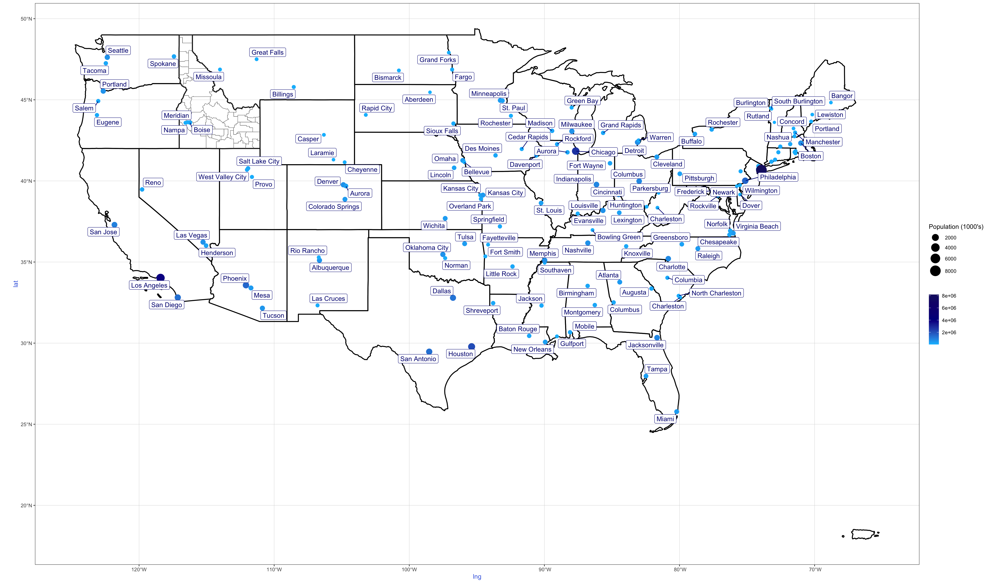

### Libraries


::: {.cell}

```{.r .cell-code}
library(USAboundaries)
library(dplyr)
library(ggplot2)
library(sf)
```
:::


# Task - Visualization


::: {.cell}

```{.r .cell-code}
states <- us_states() %>%
  filter(!(state_abbr %in% c("AK", "HI")))

idaho_counties <- us_counties(states = "Idaho")

cities <- us_cities() %>%
  filter(state_name %in% state.name) %>%
  arrange(state_name, desc(population)) %>%
  group_by(state_name) %>%
  slice_head(n = 3) %>%
  mutate(rank = row_number()) %>%
  ungroup()

cities <- cities %>%
  mutate(lng = st_coordinates(geometry)[, 1],
         lat = st_coordinates(geometry)[, 2])

ggplot() +
  geom_sf(data = states, fill = NA, color = "black", size = 0.5) +
  geom_sf(data = idaho_counties, fill = NA, color = "black", linetype = "dotted", size = 0.3) +
  geom_point(data = cities, aes(x = lng, y = lat, size = population), color = "blue", alpha = 0.7) +
  scale_size_continuous(range = c(2, 10), breaks = c(2000, 4000, 6000, 8000), labels = c("2000", "4000", "6000", "8000"), name = "Population (1,000)") +
  geom_text(data = cities, aes(x = lng, y = lat, label = city), size = 3, color = "blue", nudge_y = 0.3) +
  coord_sf(xlim = c(-125, -65), ylim = c(25, 50), expand = FALSE) +
  theme_minimal() +
  labs(title = "Top 3 Cities by Population in Each Contiguous US State")
```

::: {.cell-output-display}
{width=2304}
:::

```{.r .cell-code}
ggsave("us_map.png", width = 16, height = 10)
```
:::
