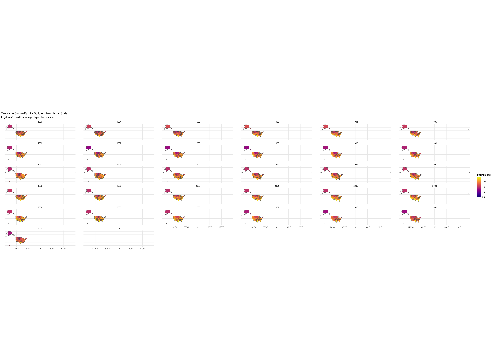
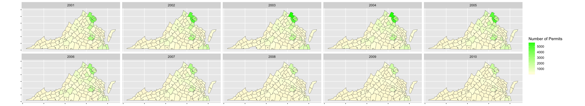

### Libraries


::: {.cell}

```{.r .cell-code}
library(USAboundaries)
library(tidyverse)
library(sf)
library(buildings)
library(geofacet)
```
:::


### Data Sets


::: {.cell}

```{.r .cell-code}
us_states <- us_states()

data("permits")
single_family_permits <- permits %>% filter(variable == "Single Family")

state_permits <- single_family_permits %>%
  group_by(StateAbbr, year) %>%
  summarize(total_permits = sum(value, na.rm = TRUE)) %>%
  mutate(StateAbbr = as.character(StateAbbr))

state_map_data <- us_states %>%
  left_join(state_permits, by = c("state_abbr" = "StateAbbr"))

virginia_state <- us_states() %>% 
  filter(name == "Virginia")

virginia_counties <- us_counties() %>%
  select(-state_name) %>%
  filter(state_abbr == "VA") %>%
  rename(countyname = namelsad)

permit_data <- permits %>%
  filter(variable == "Single Family")

grouped_permit <- permit_data %>%
  group_by(StateAbbr, year, variable) %>%
  summarise(total = sum(value))

virginia_permits <- permit_data %>%
  filter(StateAbbr == "VA")

va <- virginia_permits %>%
  left_join(virginia_counties, by = "countyname") %>% 
  filter(year > 2000) %>%
  st_sf()
```
:::


# Case Study - Visualizations


::: {.cell}

```{.r .cell-code}
ggplot(state_map_data) + 
  geom_sf(aes(fill = log1p(total_permits))) + 
  facet_wrap(~year) + 
  scale_fill_viridis_c(option = "plasma", name = "Permits (log)") + 
  labs(
    title = "Trends in Single-Family Building Permits by State",
    subtitle = "Log-transformed to manage disparities in scale"
  ) + 
  theme_minimal()
```

::: {.cell-output-display}
{width=2880}
:::
:::

::: {.cell}

```{.r .cell-code}
ggplot() +
  geom_sf(data = va, aes(fill = value)) +
  facet_wrap(~year, nrow = 2)  +
  scale_fill_gradient2(low = "red", mid = "lightyellow", high = "green", midpoint = 200) +
  labs(x = NULL, y = NULL) +
  theme(
    axis.line.x = element_blank(),
    axis.line.y = element_blank(),
    axis.text.x = element_blank(),
    axis.text.y = element_blank()
  ) + 
  labs(fill = "Number of Permits",
       )
```

::: {.cell-output-display}
{width=2112}
:::
:::


# Summary of Insights

The maps show trends in building permits for single-family homes through different years across the United States and Idaho. The first map highlights differences between states. Large states like California have high numbers of permits, while smaller states like North Dakota have much lower numbers, even in their peak years. I used a log-transformation to make it easier to compare these states by reducing the effect of extreme numbers.

The second map focuses on Virginia, which is where I currently reside. This map displays trends in each county from 2001-2010. There is a noticeable decrease in the number of permits in the Northern Virginia area, whereas the other counties remain steady. I also applied the log-transformation here to make it easier to compare areas with different levels of permits.

# Visualization Choices:
I chose maps for these visuals because they are great for showing geographic data and trends. The facet_wrap() function allows us to compare the data over time, showing how the trends change year by year. To deal with the big differences in permit numbers, I used a log-transformation to balance the data. I used the viridis color scale, which is easy to read and helps highlight the permit totals clearly.