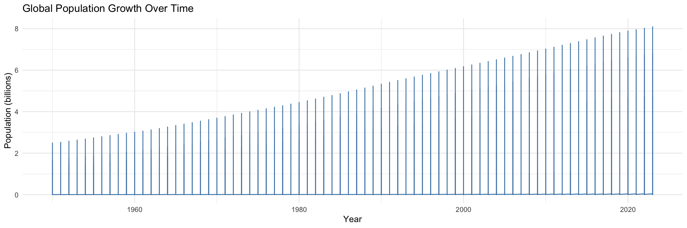
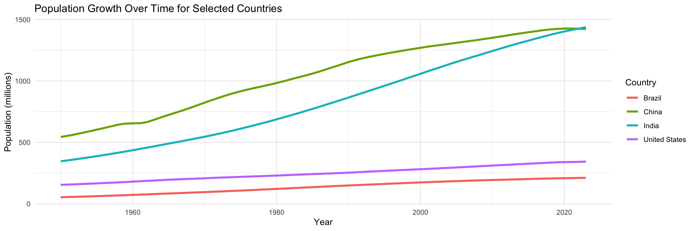
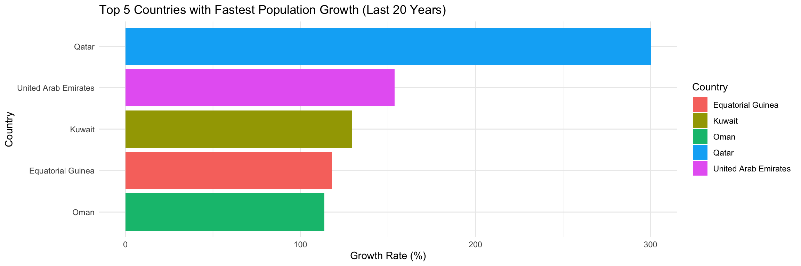

# Potential Data Sources

1.[**CO2 Emissions**](https://ourworldindata.org/co2-emissions): This data set analyzes the global C02 emissions which could provide some important insights

2.[**Population Growth**](https://ourworldindata.org/population-growth):This one will show the populations growth by country. This data set could analyze long term population trends.

3.[**Global Education**](https://ourworldindata.org/global-education): This data shows detailed demographic breakdowns of the worlds educational rates

4.[**Renewable Education**](https://ourworldindata.org/renewable-energy): This tracks the renewable energy by country which could offer some interesting insights

# Data Set for this Task

[**Population Growth**](https://ourworldindata.org/population-growth):

I found all four of these data sets on the 'Our World in Data' website, and they seemed interesting and promising with the data provided. However, sifting through the data, the Population Growth data set option seemed the most interesting to me overall as it provided options for me to create actionable and relevant insights and display said insights in a way that is informative.

### Libraries & Data Sets


::: {.cell}

```{.r .cell-code}
library(readr)
library(ggplot2)
library(dbplyr)
library(tidyverse)

data <- read.csv('population.csv')

colnames(data) <- c("Country", "Country_Code", "Year", "Population")
```
:::


# Task - Visualization


::: {.cell}

```{.r .cell-code}
ggplot(data, aes(x = Year, y = Population / 1e9)) +
  geom_line(color = "steelblue") +
  labs(title = "Global Population Growth Over Time", y = "Population (billions)", x = "Year") +
  theme_minimal()
```

::: {.cell-output-display}
{width=1152}
:::

```{.r .cell-code}
selected_countries <- c("China", "India", "United States", "Brazil")
data %>%
  filter(Country %in% selected_countries) %>%
  ggplot(aes(x = Year, y = Population / 1e6, color = Country)) +
  geom_line(size = 1.2) +
  labs(title = "Population Growth Over Time for Selected Countries",
       x = "Year", y = "Population (millions)") +
  theme_minimal()
```

::: {.cell-output-display}
{width=1152}
:::

```{.r .cell-code}
data %>%
  filter(Year >= max(Year) - 20) %>%
  group_by(Country) %>%
  summarize(Growth_Rate = (last(Population) - first(Population)) / first(Population) * 100) %>%
  arrange(desc(Growth_Rate)) %>%
  slice(1:5) %>%
  ggplot(aes(x = reorder(Country, Growth_Rate), y = Growth_Rate, fill = Country)) +
  geom_bar(stat = "identity") +
  coord_flip() +
  labs(title = "Top 5 Countries with Fastest Population Growth (Last 20 Years)",
       x = "Country", y = "Growth Rate (%)") +
  theme_minimal()
```

::: {.cell-output-display}
{width=1152}
:::
:::


# Limitations and Follow-Up Questions
Limitations: The data set provides a broad overview but lacks detailed data, specifics pertaining to sex and age and groups them up as 'Population' which could affect insights into specific demographic patterns. Additionally, smaller countries or territories might have inconsistencies in older records due to data limitations.

Future Questions: What factors might be affecting population growth in different countries?
How does migration influence population trends, and are there notable effects?
