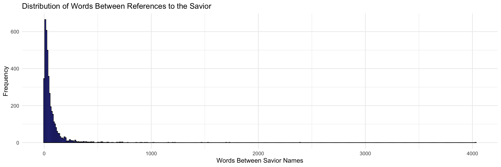

### Libraries & Data Sets


::: {.cell}

```{.r .cell-code}
library(rio)
library(tidyverse)

scriptures_data <- rio::import("http://scriptures.nephi.org/downloads/lds-scriptures.csv.zip") %>% 
  as_tibble()

savior_names <- read_rds("https://byuistats.github.io/M335/data/BoM_SaviorNames.rds")
```
:::


# Case Study - Visualization


::: {.cell}

```{.r .cell-code}
bom_text <- scriptures_data %>%
  filter(volume_title == "Book of Mormon") %>%
  pull(scripture_text) %>%
  str_c(collapse = " ")

savior_patterns <- str_c(savior_names$name, collapse = "|") 

split_text <- str_split(bom_text, pattern = savior_patterns, simplify = TRUE)

word_counts <- str_count(split_text, "\\S+") 

word_count_plot <- word_counts %>%
  as_tibble() %>%
  rename(words_between = value) %>%
  filter(words_between > 0) %>% 
  ggplot(aes(x = words_between)) +
  geom_histogram(binwidth = 10, fill = "blue", alpha = 0.7, color = "black") +
  labs(
    title = "Distribution of Words Between References to the Savior",
    x = "Words Between Savior Names",
    y = "Frequency"
  ) +
  theme_minimal()

print(word_count_plot)
```

::: {.cell-output-display}
{width=1152}
:::

```{.r .cell-code}
average_words <- mean(word_counts[word_counts > 0], na.rm = TRUE) # Exclude empty splits

cat("The average number of words between Savior name references is:", average_words, "\n")
```

::: {.cell-output .cell-output-stdout}

```
The average number of words between Savior name references is: 64.86772 
```


:::
:::


# Results

The average number of words between Savior name referneces was calculated to be 64.86772, or rather 64 since we cannot have .86772 of a word. 