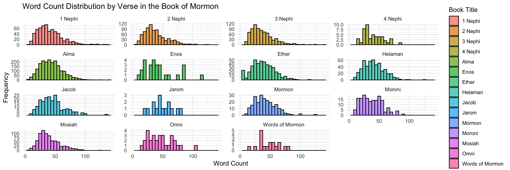

### Libraries & Data Sets


::: {.cell}

```{.r .cell-code}
library(rio)
library(tidyverse)

scriptures_data <- rio::import("http://scriptures.nephi.org/downloads/lds-scriptures.csv.zip") %>% 
  as_tibble()
```
:::


# Case Study - Interactive Visualization


::: {.cell}

```{.r .cell-code}
avg_verse_length <- scriptures_data %>%
  filter(volume_title %in% c("New Testament", "Book of Mormon")) %>%
  mutate(word_count = str_count(scripture_text, "\\w+")) %>%
  group_by(volume_title) %>%
  summarize(avg_word_count = mean(word_count, na.rm = TRUE))

avg_verse_length
```

::: {.cell-output .cell-output-stdout}

```
# A tibble: 2 × 2
  volume_title   avg_word_count
  <chr>                   <dbl>
1 Book of Mormon           40.5
2 New Testament            22.7
```


:::

```{.r .cell-code}
jesus_mentions <- scriptures_data %>%
  filter(volume_title %in% c("New Testament", "Book of Mormon")) %>%
  mutate(mentions = str_count(scripture_text, "\\bJesus\\b")) %>%
  group_by(volume_title) %>%
  summarize(total_mentions = sum(mentions, na.rm = TRUE))

jesus_mentions
```

::: {.cell-output .cell-output-stdout}

```
# A tibble: 2 × 2
  volume_title   total_mentions
  <chr>                   <int>
1 Book of Mormon            184
2 New Testament             976
```


:::

```{.r .cell-code}
word_count_distribution <- scriptures_data %>%
  filter(volume_title == "Book of Mormon") %>%
  mutate(word_count = str_count(scripture_text, "\\w+")) %>%
  group_by(book_title) %>%
  summarise(word_counts = list(word_count)) %>%
  unnest(word_counts)

ggplot(word_count_distribution, aes(x = word_counts, fill = book_title)) +
  geom_histogram(binwidth = 5, color = "black", alpha = 0.7) +
  facet_wrap(~ book_title, scales = "free_y") +
  labs(title = "Word Count Distribution by Verse in the Book of Mormon",
       x = "Word Count",
       y = "Frequency",
       fill = "Book Title") +
  theme_minimal()
```

::: {.cell-output-display}
{width=1152}
:::
:::