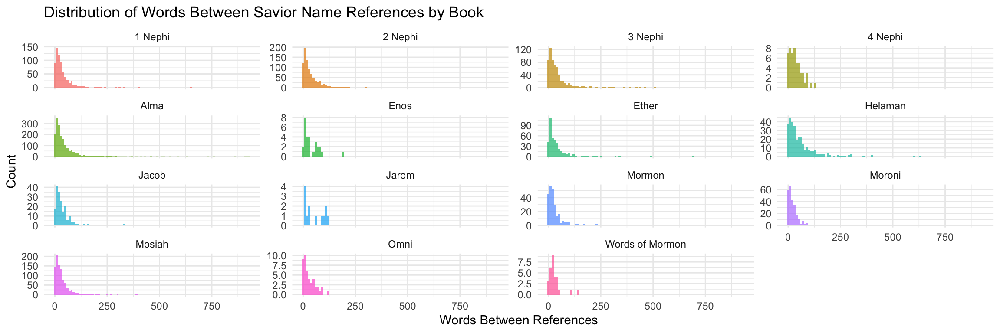

### Libraries & Data Sets


::: {.cell}

```{.r .cell-code}
library(rio)
library(tidyverse)

scriptures_data <- rio::import("http://scriptures.nephi.org/downloads/lds-scriptures.csv.zip") %>% 
  as_tibble()

savior_names <- read_rds("https://byuistats.github.io/M335/data/BoM_SaviorNames.rds")
```
:::


# Case Study - Visualization


::: {.cell}

```{.r .cell-code}
scripture_text <- scriptures_data %>%
  filter(volume_title == "Book of Mormon") %>%
  select(book_title, scripture_text) %>%
  rename(book = book_title, text = scripture_text)

scripture_text <- scripture_text %>%
  mutate(text = str_to_lower(text))

savior_names <- tolower(savior_names$name)

calculate_distances <- function(book_text, savior_names) {
  savior_pattern <- paste0("\\b(", paste(savior_names, collapse = "|"), ")\\b")
  
  splits <- strsplit(book_text, savior_pattern, perl = TRUE)
  
  distances <- lengths(strsplit(unlist(splits), "\\s+")) - 1
  return(distances)
}

distance_data <- scripture_text %>%
  group_by(book) %>%
  summarise(distances = list(calculate_distances(paste(text, collapse = " "), savior_names))) %>%
  unnest(distances)

ggplot(distance_data, aes(x = distances, fill = book)) +
  geom_histogram(binwidth = 10, position = "dodge", alpha = 0.7) +
  facet_wrap(~book, scales = "free_y") +
  labs(
    title = "Distribution of Words Between Savior Name References by Book",
    x = "Words Between References",
    y = "Count"
  ) +
  theme_minimal() +
  theme(legend.position = "none")
```

::: {.cell-output-display}
{width=1152}
:::
:::