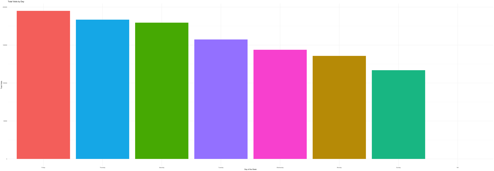
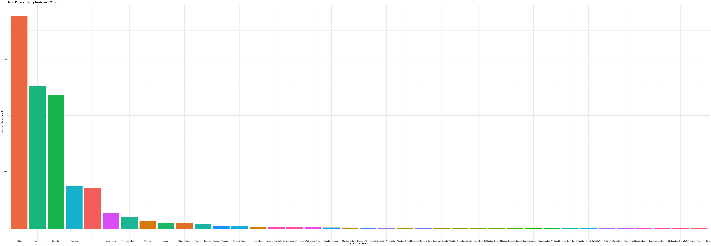

### Libraries & Data Sets


::: {.cell}

```{.r .cell-code}
library(tidyverse)
library(readr)
library(purrr)

chipotle_data <- read_csv("https://byuistats.github.io/M335/data/chipotle_reduced.csv")
```
:::


# Task - Visualization


::: {.cell}

```{.r .cell-code}
parse_popularity <- function(input_string) {
  cleaned_string <- str_remove_all(input_string, "[{}\"]")
  key_value_pairs <- str_split(cleaned_string, ",")[[1]]
  
  tibble(
    day = sapply(key_value_pairs, function(x) str_split(x, ":")[[1]][1]),
    visits = as.numeric(sapply(key_value_pairs, function(x) str_split(x, ":")[[1]][2]))
  )
}

chipotle_data <- chipotle_data %>%
  mutate(visits_by_day = map(popularity_by_day, parse_popularity))

total_visits <- chipotle_data %>%
  unnest(visits_by_day) %>%
  group_by(day) %>%
  summarise(total_visits = sum(visits, na.rm = TRUE)) %>%
  arrange(desc(total_visits))

ggplot(total_visits, aes(x = reorder(day, -total_visits), y = total_visits, fill = day)) +
  geom_col(show.legend = FALSE) +
  labs(
    title = "Total Visits by Day",
    x = "Day of the Week",
    y = "Total Visits"
  ) +
  theme_minimal()
```

::: {.cell-output-display}
{width=4416}
:::

```{.r .cell-code}
find_most_popular_day <- function(input_string) {
  data <- parse_popularity(input_string)
  max_visits <- max(data$visits)
  most_popular <- data %>%
    filter(visits == max_visits) %>%
    pull(day)
  paste(most_popular, collapse = ", ")
}

chipotle_data <- chipotle_data %>%
  mutate(most_popular_day = map_chr(popularity_by_day, find_most_popular_day))

popular_day_count <- chipotle_data %>%
  count(most_popular_day, name = "restaurant_count") %>%
  arrange(desc(restaurant_count))

ggplot(popular_day_count, aes(x = reorder(most_popular_day, -restaurant_count), y = restaurant_count, fill = most_popular_day)) +
  geom_col(show.legend = FALSE) +
  labs(
    title = "Most Popular Day by Restaurant Count",
    x = "Day of the Week",
    y = "Number of Restaurants"
  ) +
  theme_minimal()
```

::: {.cell-output-display}
{width=4416}
:::

```{.r .cell-code}
saveRDS(chipotle_data, "chipotle_data.rds")
```
:::


# Recommendations and Insights 

Chipotle should run its big promotion on Thursday and Friday, as these days have the most customer visits. Focusing on these high-traffic days will likely bring the best results. To help quieter days like Sunday or midweek days such as Wednesday, smaller promotions could encourage more customers to visit during these times.

The first bar chart, showing total visits by day of the week, was the most helpful for deciding when to run the promotion. It clearly shows which days bring in the most customers overall. The second chart, which highlights the most popular day for each restaurant, is also useful for local strategies. However, the first chart provides a better picture for planning promotions across all locations.

Additional Insights:

Balancing Customer Visits: High-traffic days like Thursday and Friday should get major promotions, while low-traffic days like Sunday could benefit from smaller deals to spread out visits more evenly.