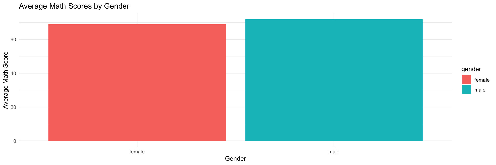
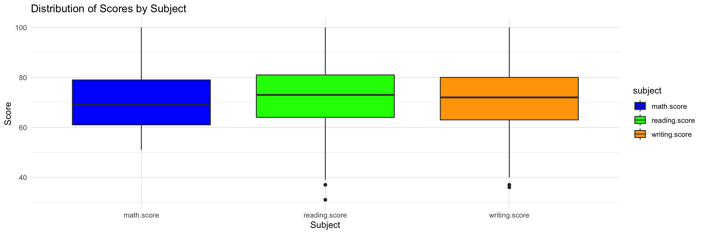
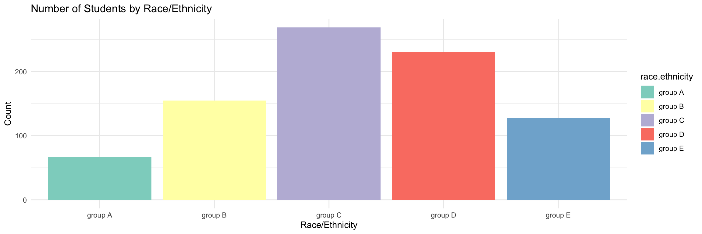
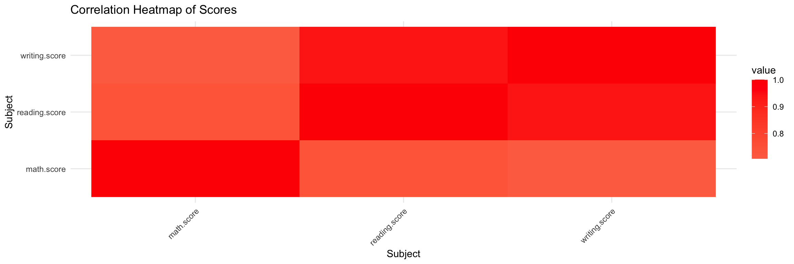

# Introduction
This project explores student performance data, aiming to uncover key insights into the relationships between subject scores and factors such as gender and ethnicity. By visualizing and analyzing the distribution of scores across math, reading, and writing, we aim to identify trends, disparities, and potential areas for educational improvement. The analysis will delve into gender-based performance differences, providing a clearer picture of how males and females perform across subjects, as well as examining ethnic diversity to understand the composition of the student body and its potential correlation with academic outcomes. Through this comprehensive analysis, we hope to inform targeted educational strategies that can enhance student learning and support diverse needs.

### Libraries & Data Sets


::: {.cell}

```{.r .cell-code}
library(readr)
library(tidyverse)
library(ggplot2)
library(reshape2)

data <- read.csv("StudentsPerformance 2.csv")
```
:::


## Data Wrangling


::: {.cell}

```{.r .cell-code}
data_selected <- select(data, gender, race.ethnicity, parental.level.of.education, 
                        lunch, test.preparation.course, math.score, 
                        reading.score, writing.score)

data_filtered <- filter(data_selected, math.score > 50)

data_mutated <- mutate(data_filtered, average.score = (math.score + reading.score + writing.score) / 3)

data_arranged <- arrange(data_mutated, desc(average.score))

gender_summary <- data_arranged %>%
  group_by(gender) %>%
  summarize(avg_math = mean(math.score, na.rm = TRUE),
            avg_reading = mean(reading.score, na.rm = TRUE),
            avg_writing = mean(writing.score, na.rm = TRUE))

ethnicity_count <- data_arranged %>%
  count(race.ethnicity)

data_long <- data_arranged %>%
  pivot_longer(cols = c(math.score, reading.score, writing.score), 
               names_to = "subject", 
               values_to = "score")
```
:::


# Project - Visualizations


::: {.cell}

```{.r .cell-code}
gender_plot <- ggplot(gender_summary, aes(x = gender, y = avg_math, fill = gender)) +
  geom_bar(stat = "identity") +
  labs(title = "Average Math Scores by Gender", x = "Gender", y = "Average Math Score") +
  theme_minimal()

score_plot <- ggplot(data_long, aes(x = subject, y = score, fill = subject)) +
  geom_boxplot() + 
  labs(title = "Distribution of Scores by Subject", x = "Subject", y = "Score") +
  theme_minimal() +
  scale_fill_manual(values = c("math.score" = "blue", "reading.score" = "green", "writing.score" = "orange"))

ethnicity_plot <- ggplot(ethnicity_count, aes(x = race.ethnicity, y = n, fill = race.ethnicity)) +
  geom_bar(stat = "identity") + 
  labs(title = "Number of Students by Race/Ethnicity", x = "Race/Ethnicity", y = "Count") + 
  theme_minimal() +
  scale_fill_brewer(palette = "Set3")

score_data <- select(data_filtered, math.score, reading.score, writing.score)

cor_matrix <- cor(score_data)

melted_cor_matrix <- melt(cor_matrix)

heatmap_plot <- ggplot(melted_cor_matrix, aes(Var1, Var2, fill = value)) + 
  geom_tile() + 
  scale_fill_gradient2(low = "blue", high = "red", mid = "white", midpoint = 0) + 
  labs(title = "Correlation Heatmap of Scores", x = "Subject", y = "Subject") +
  theme_minimal() + 
  theme(axis.text.x = element_text(angle = 45, hjust = 1))

print(gender_plot)
```

::: {.cell-output-display}
{width=1152}
:::

```{.r .cell-code}
print(score_plot)
```

::: {.cell-output-display}
{width=1152}
:::

```{.r .cell-code}
print(ethnicity_plot)
```

::: {.cell-output-display}
{width=1152}
:::

```{.r .cell-code}
print(heatmap_plot)
```

::: {.cell-output-display}
{width=1152}
:::
:::


# Analysis and Conclusion

Gender Performance: The bar chart illustrating average math scores by gender highlights a subtle performance difference between males and females. Males tend to have slightly higher average math scores compared to females. This could warrant further investigation into factors contributing to these differences, such as teaching methods, student engagement, or gender-related educational support.

Distribution of Scores: The boxplots provide a clear visual representation of the distribution and spread of scores across subjects. Notably, the reading scores appear to be generally higher than both writing and math, with the writing scores trailing closely behind. The presence of potential outliers in each subject suggests that there may be students who are either excelling or struggling significantly in particular areas, pointing to opportunities for targeted interventions to support these students more effectively.

Ethnic Diversity: The race/ethnicity plot provides insight into the ethnic composition of the student population. Group C has the highest number of students, surpassing 200, whereas Group A has the fewest students, with a count under 100. This disparity in representation could be an important factor when exploring educational outcomes, as different ethnic groups might face unique challenges or benefit from specific resources.

Correlations: The correlation heatmap reveals the relationships between math, reading, and writing scores. A strong correlation is evident between reading and writing scores, suggesting that students who perform well in one are likely to perform well in the other. The weaker correlation between math and the other two subjects might indicate that math performance is influenced by different factors, which could lead to differentiated teaching strategies for math education.


